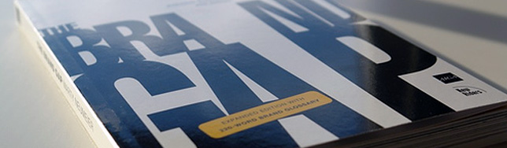

Branding books don't have to be huge or full of complicated theories, they can be fun, practical and inspiring. [The Brand Gap](http://amzn.com/0321348109 "Buy the book at Amazon.com"), by **Marty Neumeier**, is a fast-reading book containing a good amount of definitions - good enough to not make you dizzy - and great visual examples of today's branding reality.

## Overall idea of the book

The gap, as Neumeier points out, is the distance between strategy and creativity, different fields controlled by different brain hemispheres (and generally different people). Throughout [the book](http://amzn.com/0321348109), the author explains that a **good brand** is made by people or companies who master five branding disciplines: differentiation, collaboration, innovation, validation and cultivation. These five subjects and most topics of the book are illustrated by examples and historical facts, running along with diagrams and photos.

While reading the book, you'll figure out that not only the content but the **design of the book** is also inspiring: from the book cover (a minimalistic yet effective design) to the one-sentence pages, the relevant graphic additions and the bold citations.

## Just one small criticism

If I were to point a flaw on the book, I'd say is the amount of **Americanized examples**. Although I can't argue with the fact that most of the brands we know are American, it wouldn't hurt to throw a few non-American cases.

[The Brand Gap](http://amzn.com/0321348109) is an amazing book. The almost 200 pages are **easy to read** and the subject is important to all people working on branding, from the junior designer to the CEO. The book, in fact, doesn't feel like a book, it's like an after class conversation between **the student and the cool teacher** who explains the way you understand and makes you want more about it.
