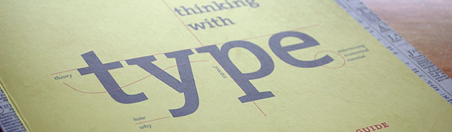

I must admit that typography wasn't always my favourite field in design. Until a couple years ago fonts and texts were mere supporting actors of the design _movie_. My mind changed when I finally realized that typography is as important as the shapes, the colours and the styles used. One of the books that helped me _get there_ was **Thinking with Type**, by [Ellen Lupton](http://www.elupton.com/).

## Overall idea of the book

Always using history as a guide, the author shows how the letters and texts can influence the way we see a piece of design and how we can improve **readability** by following some rules. Personally, one of these tips that really caught my attention was: _When using stacked letters_ – like the ones on spines of books – _we should always use small caps with centred column_. Maybe this is common sense to some people, but for me it was something that I had never realized.

The [book](http://amzn.com/1568984480 "Buy this book at Amazon") is also very rich on examples. Fonts familiar to most designers – or anyone in the field – are presented and described throughout the pages. **Futura**, for example, was designed in the late 20's by [Paul Renner](http://en.wikipedia.org/wiki/Paul_Renner) who sought on "honest expression of technical processes". But be warned, as the author constantly says, this is not a book about fonts.

> _"The relationships among letters in a font are more important than the identity of individual characters."_

## History or Design Book?

If you are not into history and want to get straight to the **technical** part you might want to skip a few pages, but by doing this you'll miss the best part of the book, like when the author explains the reason of the terms **uppercase** and **lowercase**: in the old _printshops_, they used to store the case of the capital letter in the upper drawer). Historical fact or plain curiosity, at least it helps to make the reader more comfortable with the subject.

## Conclusion

From letters to text, grid layout to html, **Thinking with Type** is a book that explains the use of typography in different media and for different audiences. This may not be your ultimate guide about it, but will surely be on your mind in your next designs.
