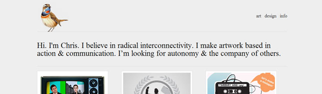

After spending several months developing this website and facing different issues throughout the project, I've learnt a few things about the **process** of building a **portfolio** website. The first big decision is to define what sort of website you are going to implement, they all have their pros and cons, but which one is **right for you**?

## The answer

The answer is... well, it's up to you to decide! But I'll try to make your decision a little easier by explaining the main styles used for this kind of **project**.

There are several ways to build a **portfolio** website, I'll focus this post on 3 main styles: **Single Page**, **Full Site** and **Blog** style.

## Single Page Style

Single page website is very popular among **designers** for being a great solution to display your work and sending a message at the same time. Think of it as a one page [résumé](http://en.wikipedia.org/wiki/R%C3%A9sum%C3%A9) where the prospective employer (or in this case - the client) can have a look at your past information, your personal details and have a glance at your work.

This kind of project is usually quicker to **set up** and easier to **maintain**, as all of the content - or at least most of it - is inserted in only one page.

Here are a few examples of great Single Page portfolio websites:

  
  
  
  
  
  
  
  

## Full Site

The idea of a **Full site** style is not only to expand the topics used on the Single Page style but add more content to it as well. Description of services provided, detailed curriculum vitae, news section, e-mail forms and location details are just a few example of **new sections** used in this style.

Using a Full Site style will allow you to provide more information for your visitors, but the **implementation time** and **complexity** grow in the same proportion.

Here are a few examples of great Full Page portfolio websites:

  
  
  
  
  
  
  
  

## Blog Style

Just like the Full Site style, the **content is king**. The blog area is the site's main attraction and is used to display your portfolio, news or anything else you reckon will interest your visitors.

This kind of project takes more time to implement - depending on your **CMS** tools and plugins required. Also a blog style needs to be **updated** more frequently than the other styles. Bear this in mind when planning your website.

Here are a few examples of great blog style portfolio websites:

  
  
  
  
  
  
  
  

## How to make the decision

How much free time do you have? Are you currently working full-time? Do you like to write and have something to say? How frequently would you update your site? Are good in coding, integration and site maintenance?

These **questions** might help you decide which style is the one for you. If your time is short and you need samples of your work right away, then maybe the **Single Page** is the answer. If you don't have anything important to say or you don't have that much time for updates, maybe the **Blog style** is not a good idea, no one likes to visit websites with posts dated from last year or content copied from other websites!

## Conclusion

Whatever style you choose, **try to stick to it until it's finished** or else you will end up having a Frankenstein style website. **Planning** is important. Spend some time **brainstorming** and the right style will come to you naturally.
