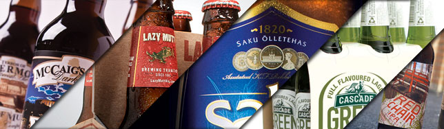
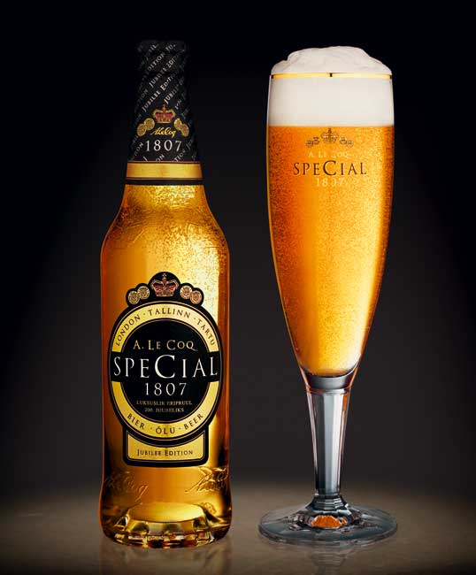
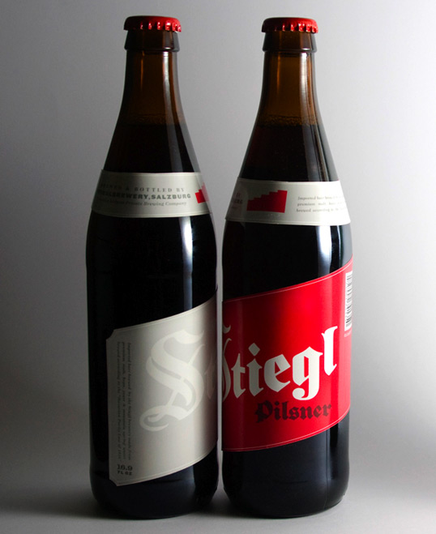
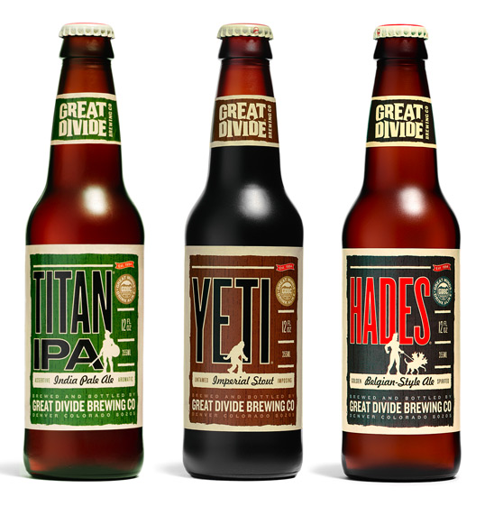
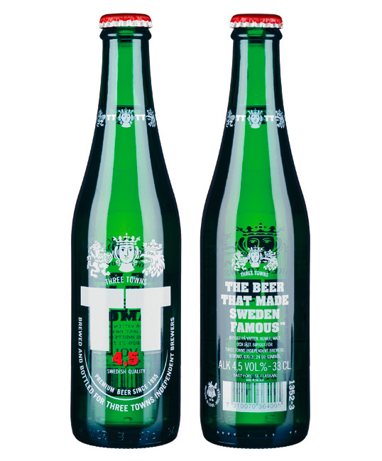
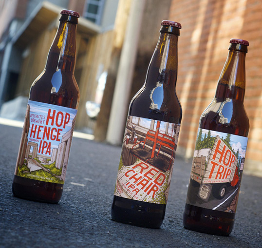

From all the different fields of **print design** the one that always gets my attention is the **beer bottles** design. It's a saturated market and all brands want to attract their consumers. To **stand out** from other packages in the shelf, the design has to be very creative. Here I've made a selection of 15 beer bottles, labels and packaging design that will inspire you to design outside the box and make your work stand out. Cheers!

  
  

  
  

  
  

  
  

  
  

  
  

  
  

  
  

  
  

  
  

  
  

  
  

  
  

  
  

  
  

## Sources

For more package and print design material, go to: [Behance Network](http://www.behance.net/), [The Dieline](http://www.thedieline.com/) and [Lovely Package](http://lovelypackage.com/).
