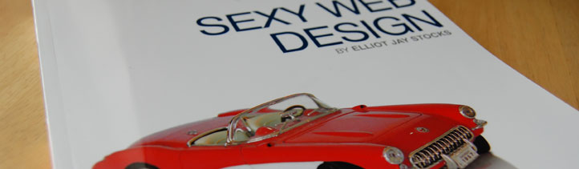

Have you ever wondered if your **design process** is the right one for your projects? Have you ever thought that maybe there's a step missing or maybe a specific phase that needs more emphasis on? After doing some research on the subject I found out that [Elliot Jay Stocks](http://elliotjaystocks.com/), a very cool designer from the UK, had recently written a book about this called **Sexy Web Design** published by [Sitepoint](http://www.sitepoint.com), a cool Aussie based book publisher and web & design reference **website**.

## Overall idea of the book

In this book, Elliot shows you his **process** of creating a sexy website, from the initial **briefing** with the client to the final updates on the **mockup**. The author explains the purpose of each phase, exemplifies showing successful websites online and applies the proper technique on a **demo project** that is covered throughout the book.

Although the [book](http://www.sitepoint.com/books/sexy1/) covers a lot of content, the book doesn't go very deep on each of them and some topics are left with just a few lines of explanation. Elliot tries to fix this issue by giving external **references** but sadly they are mostly to Sitepoint links or their books, which sound a little biased. Don't get me wrong, I'm a frequent reader of **Sitepoint**'s website but it wouldn't hurt to throw a few more **references**.

## The highlights

The chapter which covers **inspiration and mood** on websites is spot on just like the briefing and initial sketches approach suggested by the author. I like the idea of spending more time away from the computer to get your mind in the right place.

## Conclusion

I would really **recommend** this book to any web designer. Even if you are sure that your design process is good enough for your projects, there's always something interesting that lights a bulb in your head.
