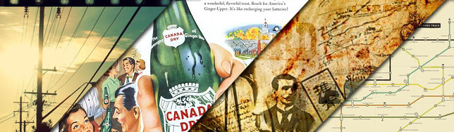

**Vintage** \- or Retro - design is the style that uses techniques, colours or shapes used in the past. I am a big fan of this style and in this post I am going to point out some of the best **websites** to find great vintage material - from illustrations and photos to tutorials and resources.

## Flickr

Flickr has an extensive selection of **vintage** and retro material. I've selected 2 of them which I use as inspiration for some design pieces.

- [Vintage Illustration Pool](http://www.flickr.com/groups/vintageillustration/pool/)
- [Vintage Advertising](http://www.flickr.com/groups/vintage_advertising/)

## DeviantArt

This on-line community showcases vintage material in **photography**, **illustrations**, **print** and **web** design. In this website you can also find several **tutorials** to help you develop your "retro" skills.

- [Vintage Search Results](http://browse.deviantart.com/?qh=&section=&q=vintage)
- [Tutorials on Vintage Design](http://browse.deviantart.com/?qh=&section=&q=vintage#catpath=resources/tutorials&order=9&q=vintage)

## Abduzeedo

The guys at **Abduzeedo** love to post about vintage and retro design. Their **blog** is full of great material and is worth the visit. Here are some of the highlights (_check out more cool entries by searching their website_).

- [Great Vintage Advertising and Propaganda](http://abduzeedo.com/great-vintage-advertising-and-propaganda)
- [45 Cool Vintage Collages](http://abduzeedo.com/45-cool-vintage-collages)

## Behance

The **Behance Network** is another platform of great artist and works. Vintage is only one of the numerous categories found in this website, a great **bookmark** for inspiration resources.

- [General vintage entries](http://www.behance.net/Search?category=projects&main-search=vintage&realm=0)
- [Vintage web design entries](http://www.behance.net/Search?category=projects&main-search=vintage&realm=102)

## Other Useful Resources

Last but not least, here are some more websites with amazing **retro** material.

- [Glossy Retro Takes Over Web Design](http://www.inspiredm.com/2009/06/28/vintage-20-glossy-retro-takes-over-web-design/)
- [Pumped Up Propaganda of the Past](http://weburbanist.com/2009/06/09/pretty-persuasion-pumped-up-propaganda-of-the-past/)
- [50 Examples of Vintage Typography](http://www.webdesignerdepot.com/2009/07/50-examples-of-vintage-typography/)

## Your thoughts and suggestions

And what about you? Do you like vintage design? Leave a comment!
