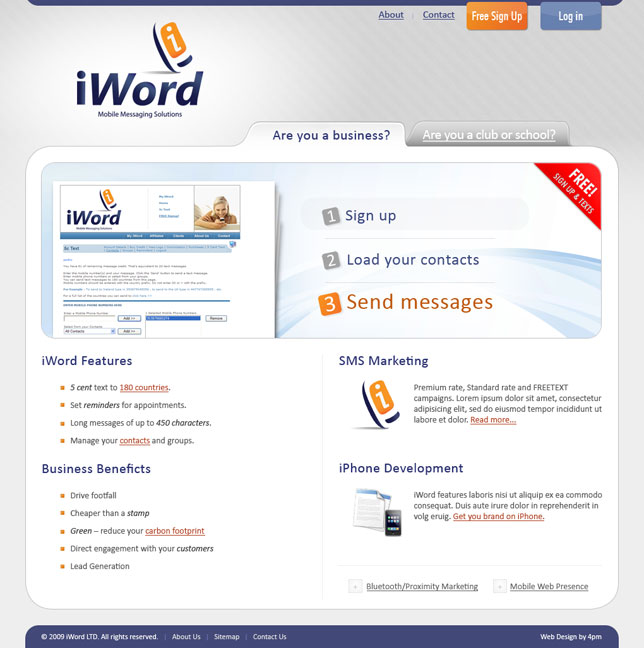

In this project I was requested to not only **redesign** their current page but to come up with 2 **animated banner** ads, which will be featured on the main portals in Ireland. The company, [iWord](http://iword.ie/) is specialized in mobile messaging solution and has been on the market since 2004.

## Web Site

Based on the logo designed by my good friend [Daniel Falcão](http://twitter.com/danielsfalcao), the web site has a big area explaining the 3 easy steps to create your account with iWord and start using. Below this area, the secondary links to content pages.

_Click the image below to view in full-size._

## Banner Ads

I had a really good time designing the banner ads. It's not something I'm used to do. In fact, it's been months since the last time I've used Adobe Flash. But I'm really happy with the results. The 2 banners were done in 2 different sizes.

**Style A**

**Style B**

## iWord

The design and html files were handed to the client who would be in charge of filling the content. Their website is [www.iword.ie](http://www.iword.ie) - _Last time I checked they were using different styles on the homepage, so it's possible that the current website is not 100% as the layout displayed here_.
