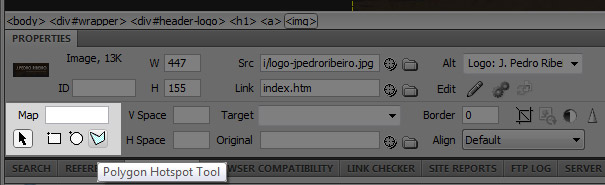

In this post I'll show you 3 useful techniques to **speed up** the display and download of images on your website: **Css Sprites**, **Image Maps** and **Inline Images**. By using these techniques you will reduce the number of _http requests_ needed to view all resources of your html. A good way to quantify the pros and cons of using these approaches is to download the Firefox Addon called [YSlow](http://developer.yahoo.com/yslow/).

## Why use these techniques?

Reducing the amount of **HTTP Requests** on your html is one of the most powerful ways to speed up your website. This topic is way too big to be explained in only one blog post, so I'll focus on the requests of **images**, although it's the same theory behind any file linked to your html.

Basically, every file necessary to run your html requires a HTTP Request. If your website has 15 images, 2 Css files and 3 javascripts, that means your browser will send 20 requests to the server. Keeping in mind that every HTTP Request is a small amount of **data** and that modern browsers support 2 to 4 simultaneous downloads, it's only wise to **reduce** the number of files in your website.

## Css Sprites

By far the most powerful technique to **reduce files** on websites. The idea is to combine a group of images into one file and control the access to it by **Css**. In this website I'm using Css Sprites on the menu, rss image, and on the social icons of every post. You can see in the example below all the 3 stages of my menu button (active, mouse over and link) combined in one single file "menu-blog.gif".

Every link on the menu is an **anchor tag** like: `<a href="/">Blog</a>` styled in a way to display only a part of that grouped image on the **background**. The width of the sprite is 113px and the total height is 84px, 28px for each menu stage. The trick here is to set a fixed size of 113px by 28px for the anchor tag (or any other tag that you want to style) and change the background position -28px for every different stage.

## Image Maps

Very popular and easy approach supported by all major browsers. Similar to the Css Sprites, you only use 1 image to represent a group but in this case all image is displayed at the same time. The link location is defined by coordinates (_area_) inside the `<map>` tag. To create easy and useful [image map](http://www.w3schools.com/TAGS/tag_map.asp) coordinates I recommend using Adobe Dreamweaver of any other WYSIWYG software of your choice - you need a visual display to create precise map areas.

## Inline Images

The lease common approach, possibly due to its **limitations** and lack of **support**, is the use of inline images. Also known as **embedded images**, this technique insert the image data in the html file by using the `[data:](http://www.ietf.org/rfc/rfc2397.txt)` scheme.

__

If you are interested in using this technique, PHP offers a function to get the `base64` value of a specific file, see example below:

_">_

## And the winner is...

Without a doubt Css Sprites is the best [technique](http://jpedroribeiro.com/wp-content/uploads/2009/09/3-image-techniques.jpg), although it might take you more time to code it depending on your css experience. Image maps can be helpful too is time is not on your side, so choose wisely based on your project and deadlines.
