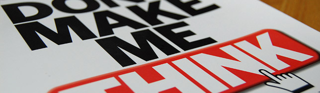

What comes to your mind when you think about **usability** in **web design**? _"Less clicks is better"_? _"Design to the average user"_? _"Content is king"_? _"Users leave your website if it doesn't load in X seconds"_? If you take any of these as a rule for your websites then you need to read this book: **Don't Make Me Think**, by [Steve Krug](http://www.sensible.com/).

## The Book

Although **usability** is becoming more and more popular among web projects these days, it is still an underrated feature. In this book, **Steve Krug** explains usability in a fun and direct way, using **illustrations** to mimic real life situations in which we all have been before. The examples and the websites featured in this book are a little outdated - the first edition was released in 2000 - but the problems are still around only with a modern design.

## Myths and Tips

Every chapter contains **precious gems** and _"facts of life"_ (as the author says) that show us how we really use websites. One example is the fact that he explains how we **scan pages** instead of reading them, and how this makes _"content is king"_ a myth. Speaking about content, Steve Krug advices us to get rid of half the words on each page, then get rid of half of what's left. This may sound weird, specially under a **SEO** point of view, but if you think again, by doing this you will end up having only the essential content (or **keywords**), the one that matters to your user.

## Conclusion

Don't let the fact that the book was originally written the year 2000 put you off. As I said before, we still face the same issues today. In 2005 was released the second version of this book which has three new chapters, including one where he talks about **CSS & web usability** and another one - one of the best IMHO - where he advices us on how to answer to our bosses when they have bad ideas. If you're still wondering if buying the book is a good idea or not, the fact that it is recommended by [Jeffrey Zeldman](http://www.zeldman.com/) should be enough for you to buy it!
