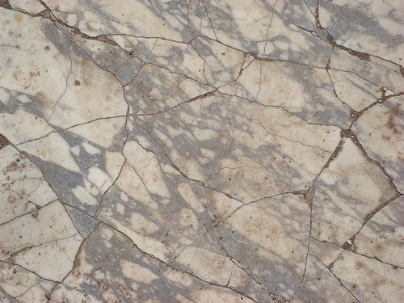
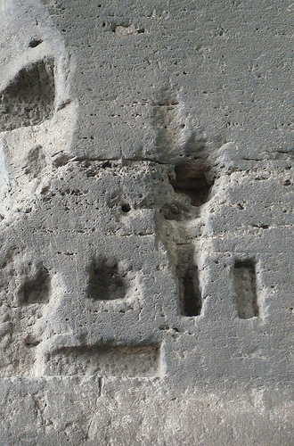

It's great to see how much the use of **textures** in websites has increased in the past months. They are an effective way of adding _flavour_ and fun to the design. I love taking pictures of walls, bricks, or surfaces around the city and analyse the pattern that they bring to the whole subject. In this article I'll share some tips that I try to put in practise when photographing textures.

## Using Textures

In web design, textures are commonly used to give a touch of **reality** or even to bring a **tactile sensation** to the project. Textures can also be used as natural **references** for digital creations.

## Photographing Textures

Taking a good **texture photo** is not rocket science - but there are a few tricks that can reduce the amount of post work on Photoshop.

The first one is **angle**. A parallel shot is normally what you are looking for - so try to keep in the same level as the surface. The second one is **sharpness** \- a texture should be always well defined. If you want a blurry texture, it's better to use effects and manipulate it later on, but always keep the original texture sharp. My third and final advice is to pay attention to **lighting**. When shooting outdoors photos, try different times of the day for different results. Cloudy days are usually the best as there is no direct light on the subject.

## Samples

Here is a selection of texture photos available on my Flickr set:

  
  

  
  

  
  

  
  

  
  

  
  

  
  

  
  

Feel free to bookmark this set as I intend to frequently update it from now on. Cheers!
