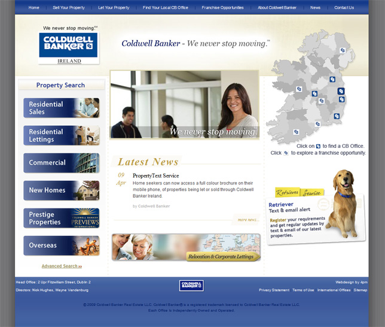

**Coldwell Banker** is a world wide known real estate company with a wide range of property markets such as Residential Homes, Apartments, Land, Holiday Homes as well as Industrial, Commercial and Retail. Their Irish branch, [Coldwell Banker Ireland](http://www.coldwellbanker.ie), contacted [4pm](http://www.4pm.ie) to create a new portal for their head office where the users could find all information about the Irish agencies and properties available.

## Web Site

In this project I was in charge of the **design** and the **front-end development**. Being a huge company with many branches around the world, they have a strong identity standard manual that has to be followed in every design project. This is good and bad at the same time. Having a colour scheme, fonts and graphics ready for you can be helpful, but they can limit your choices of design.

The main focus of the **website** is to be a portal for the Irish agencies display their properties. Here I'll display the 3 main screens of this project: frontpage, listing page and property details page. On the **homepage**, the main real estate markets are displayed as buttons on the left hand side:

On the **listing page**, we summarize the main information from each property:

On the **property details page**, we display all the property info focusing on the gallery and map location:

You can check the website running at: [www.coldwellbanker.ie](http://www.coldwellbanker.ie)
