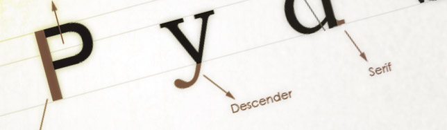
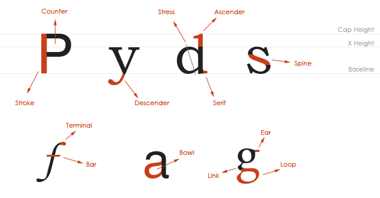

**Typography** is a field that is quite new to me. Coming from a developer background, I did not study type the way graphic designers do. Luckily, today we have [great books](http://jpedroribeiro.com/2009/07/book-review-thinking-with-type/) and various websites approaching this subject.

In this post series, which will be called _Know Your Type_, I will share some basic concepts and theories to introduce you to the amazing world of typography.

In this first post, let's find out the main **terms** used to describe specific shapes used in the characters formation and their surroundings. These terms will be repeated throughout the posts in this blog series so you can always used it as a reference.

## Terms

**Ascender:** Part of the character that extends above the baseline. **Bar:** Or _Cross Bar_, is a horizontal stroke that crosses a character. **Baseline:** Line where the type sits. **Bowl:** Curved stroke that makes the counter area. **Cap Height:** Height of a capital letter. **Counter:** White space inside a letter. **Descender:** Part of the character that extends below the baseline. **Ear:** Upper stroke of a lowercase _g_. **Link:** Stroke connecting upper and lower parts of a letter, as in the lowercase _g_. **Loop:** Lower portion of a lowercase _g_. **Serif:** Short line that extends from the main stroke. **Spine:** Curved stroke of the letter _S_. **Stress:** Direction of thickening on the curved stroke of a letter. **Stroke:** Or _Stem_, is the main stroke of the character. **Terminal:** The end of a stroke that does not end in serif. **X- Height:** Height of a lowercase letter without ascenders or descenders.
