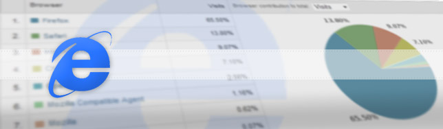

Firefox, Chrome, Safari, Internet Explorer, Opera. Developing websites to match all these **browsers** is no easy job. And don't even start talking about the different release versions. You can't force your **visitor** to use a specific software but your budget is limited and you can't create a whole new html for each one of them.

Luckily the modern versions of these **browsers** are relatively compatible, one difference here, another there. Nothing that a separate stylesheet or a [reset css](http://developer.yahoo.com/yui/reset/) can't solve. One of them, however, take this to the extreme. Yes, I am talking about the evil **IE6**.

## Losing Support?

IE6 is so full of bugs and [rendering problems](http://css-tricks.com/ie-css-bugs-thatll-get-you-every-time/) that several websites are not **supporting** it any more. [Digg](http://www.digg.com), [Youtube](http://www.youtube.com), [Orkut](http://www.orkut.com.br) and all [37 signals](http://www.37signals.com) products (Basecamp, Campfire...) just to name a few. [Personally](http://jpedroribeiro.com/about-me/) I don't design for IE6 unless the [client](http://jpedroribeiro.com/portfolio/) specifically asks for it.

## To Do or Not To Do

It is a tough decision to make, even tougher without the proper **information**. A good start is to analyse the **average visitor** of your (or your clients) website. Check their **OS**, **browser software** and work from there.

If a significant portion of the visitors have outdated browser then you might have no choice but to design for them. There are some information [out there](http://www.sitepoint.com/blogs/2009/03/06/10-fixes-for-ie6-problems/) that can help you with the most common issues.

In case you have no **traffic data** you can check generic worldwide statistics. [W3C](http://www.w3schools.com/browsers/browsers_stats.asp), [StatCounter](http://gs.statcounter.com/) and [ADTECH](http://www.adtech.info/news/pr-04-01-2009_en.htm) (Europe) are a few places that display this information **online**. Be aware that these statistics represent a very wide audience that maybe don't represent **your** audience. In this website for instance, less then 1% of my visitors use IE6. Mainly because this website\`s targets are developers, designers and general web-savvy people.

## Happy End?

According to [W3Schools](http://www.w3schools.com/browsers/browsers_stats.asp), IE6 dropped 6% from January to September of this year. So lets be positive and one day we won't have to [bother](http://jpedroribeiro.com/2009/10/why-should-i-care-about-ie6/) about this particular browser. I mean, even **Microsoft** launched a [campaign](http://arstechnica.com/microsoft/news/2009/09/microsoft-doubles-food-donations-for-ie6-to-ie8-upgrades.ars) to promote **browser** upgrade. Fingers crossed!
