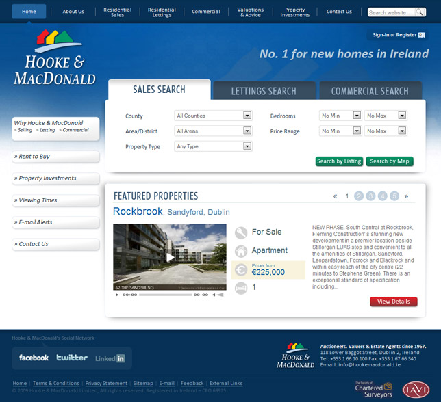
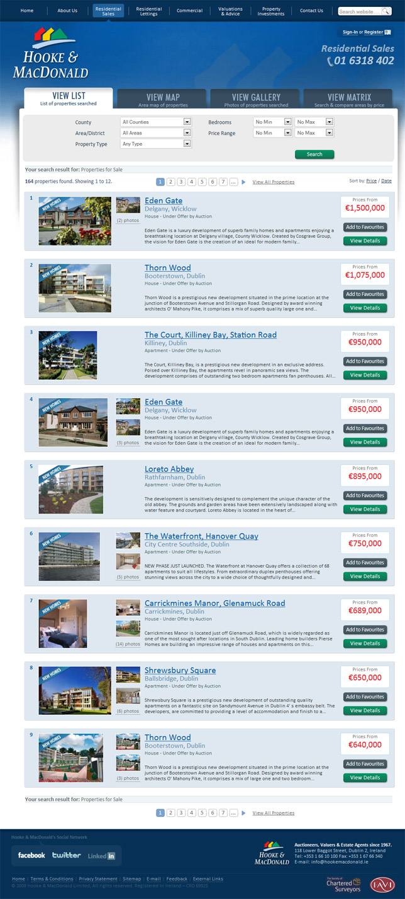
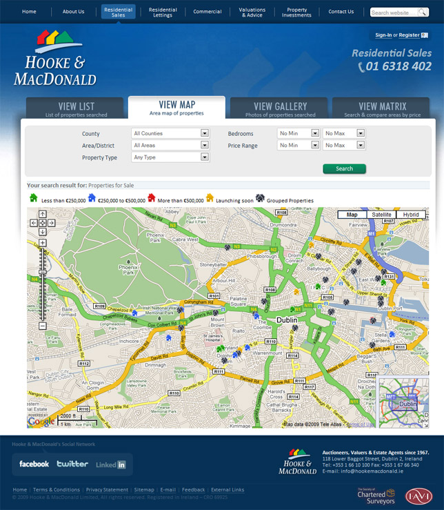
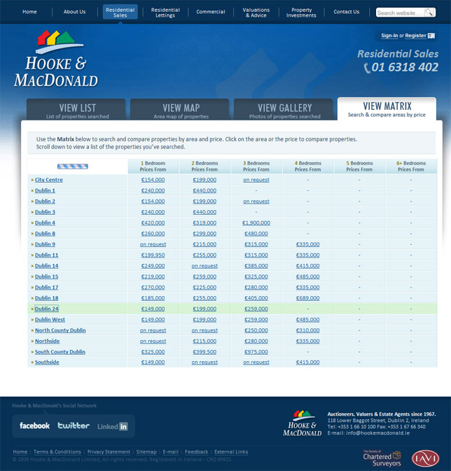
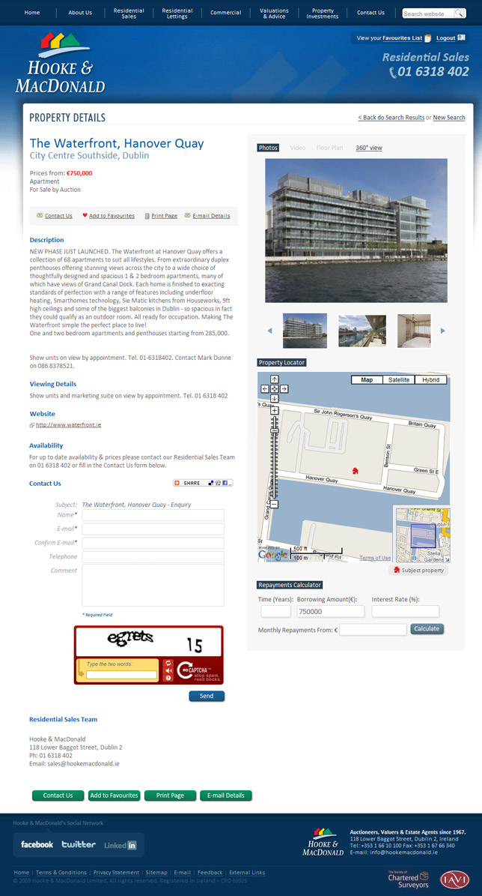

[Hooke & MacDonald](http://www.hookemacdonald.ie) is one of the major **real estate** agencies in Ireland, specially in the new homes market. They requested [4pm](http://www.4pm.ie) to come up with a new website that is modern in looks and **features**, reflecting the same high quality standards they have been keeping since 1967.

This site is one of the most complete projects **4pm** has ever done. It includes: **Google Maps integration**, Content Management System, **Video** support, User Registration, Favourite List Management, 4 different ways of **searching** properties and the 4pm\`s Property Drive solution.

I was in charge of the [design](http://jpedroribeiro.com/portfolio/) and [front-end](http://jpedroribeiro.com/portfolio/) **development**. Here are the main screenshots:

