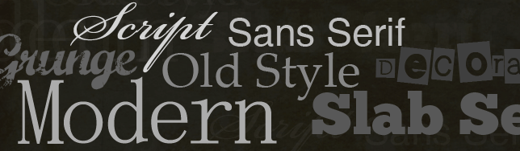

In this second part of [typography articles](http://jpedroribeiro.com/tag/typography/) we are going to learn the categories in which a type can be classified. Knowing the terms and characteristics of these groups can help you in the process of selecting the appropriate type for your project.

The number of type categories can vary according to the source, bibliography or point of view of the author. Here I'll be presenting 7 categories as did [Robin Williams](http://www.ratz.com/) in her excellent book: **Non-Designer's Type Book**.

## Old Style

The Old Style types are commonly used in the **body** of printed text due to its appearance and **readability**. They have serif and are characterized by having a gentle transition between the thick and thin strokes and the stress is always diagonal. Some examples of **Old Style** types are: Times New Roman, Palatino, Garamond and Centaur.

## Modern

Modern typefaces have serif and a strong vertical **stress** line. They display an elegant yet cold feeling. Its readability is not great due to the **contrast** between the strokes. Some examples of **Modern** types are: Bodoni, Didot and Onyx.

## Slab Serif

Slab Serif types originated from the advertising business after the Industrial Revolution. The main characteristic of these types are the thick (slap) horizontal serifs. There is very little (sometimes none) transition between the thin and thick strokes, and the stress is vertical (if any). It is very common to see this group of type being used on **webdesign** nowadays. Some examples of **Slab Serif** types are: Memphis, Clarendon and New Century Schoolbook.

## Sans Serif

Basically, sans serif types are the ones **without serif** ("sans" = french for "without"). They became popular when the **Bauhaus** school of design was formed. They have almost no transition between strokes and have a large x-height. Some examples of **Sans Serif** types are: Futura, Arial, Tahoma and Helvetica.

## Grunge

These types, also called **Distressed** or **Fringe**, are distorted, trashy and heavily manipulated. Some examples of **Grunge** types are: Rapture, Fragile and Amoebia Rain.

## Scripts

Script types are easy to spot - they emulate **handwriting**. Some examples of **Script** types are: Nuptial, Felt Tip Roman and Lamar Pen.

## Decorative

These types are created for a specific purpose of **emphasize** the content. They are also called **Ornamented** or **Novelty**. Some examples of **Decorative** types are: Rustic, Moore Liberty and Baileywick.

  

Don't forget to check out our [first part of Know Your Type](http://jpedroribeiro.com/2009/10/know-your-type-part-1-anatomy/) where we talk about the anatomy of type and explain some terms commonly used to describe types.
