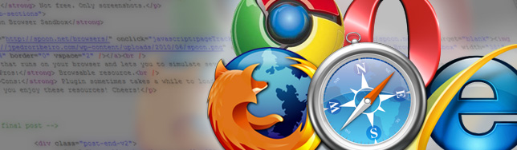
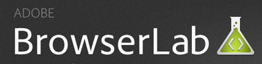

Following up on my article about [using or not IE6](http://jpedroribeiro.com/2009/10/why-should-i-care-about-ie6/), I've selected a few **tools** to help you test your website on different browsers. Most of them are free and very easy to use.

As a **front-end developer**, your task is to make a **design** run smoothly on any kind of platform - In a perfect world maybe! We know how most devices and softwares have limitations (or the project's budget) so what we must is to assure we do our best to maintain a good user experience. Also, websites don't need to look exactly the same in every browser, [or do they](http://dowebsitesneedtolookexactlythesameineverybrowser.com/)?

Since we can't always install all **browsers** in all their versions we have to rely on third-party solutions to fill this gap. These tools are the ones I often use on my **projects**, so please feel free to suggest other resources or comment on these ones.

## IETester

 This software simulates all version of Internet Explorer from 5.5+. The latest version is more stable and is a great resource to compare IE versions. **Pros:** Lightweight software, replaces IE in most cases. Multiple IE versions. Since it's a simulator, allows you to click and browser your site. **Cons:** Not much to say here, but I an occasional javascript error and still crashes sometimes.

## Browsershots

 This website has probably all browsers and platforms you will need. Type your url and their system will use a network of computers to take a screenshot of your website in the spec you requested. **Pros:** Huge range of browser types and OS's. **Cons:** Takes time to load all and you have a limit on how many times you can submit your site per day (unless you go premium). Can't "browse" your site since it's only a screenshot.

## Adobe Browserlabs

 Browserlabs was cool when it was free but now it's part of CS5, although you can still use it as trial version for a few more time. Like Browsershots, it only takes screenshots of your websites but has a lot of extra resources like onion skin option. **Pros:** Great interface and easy to use. **Cons:** Not free. Only screenshots.

## Spoon Browser Sandbox

 A plugin that runs on your browser and lets you to simulate several browsers, like IE6+, Chrome, Firefox, Safari and Opera. **Pros:** Browsable resource. **Cons:** Plugin sometimes takes a while to load.

Hope you enjoy these resources. Please leave a comment below! Cheers!
