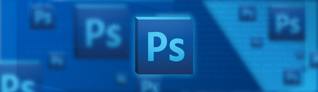
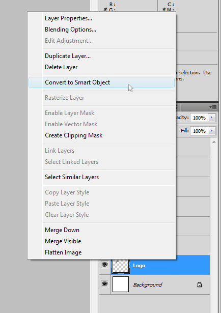
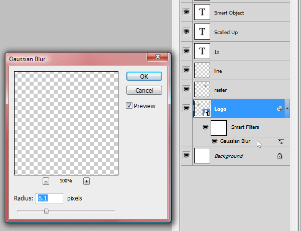

_Smart Object_ and _Smart Filter_ are two extremely useful features in **Photoshop** that will boost your design productivity. This is an easy to master technique that go hand in hand with any type of project.

## The Power of Vectors

What Smart Objects do is basically treat any raster file like a vector. You can **scale** it down and scale it up again without losing resolution or pixelating your object. Scaling up is another business, you can only go as far as the original image. This resource is great for adding logos to [web design](http://jpedroribeiro.com/portfolio/) mockups for example. You can use only one instance throughout the whole project with different sizes.

## _One Object to Rule Them All_

Another nice touch about the Smart Object is that when you do some changes to the object, all instances will be updated simultaneously. No more copying styles from layer to layer!

## _Filters?_

**Smart Filters** work in a similar way. After creating your smart object, any filter applied to it will be a smart filter automatically. The advantages are: you can edit the filter after you applied it, pretty much like **Fireworks** do it (or _Layer Styles_ in **Photoshop**). You can also copy filter to other layers if you like.

## _Creating Smart Objects and Smart Filters_

So now we understand how it works in theory, let's see how can we take advantage of this features and apply it to our design projects.

**Smart Objects**

1. First, select the layer containing the image you want to turn into a Smart Object;

3. Right-click and select Convert to Smart Object;

5. **Done!** Now your layer has a small icon showing that it is now a Smart Object.  
    (Note: To turn your layer back into an raster object, double-click the layer and select Rasterize Layer)

**Smart Filters**

1. Select a layer with your Smart Object;

3. Go to the Filter menu and select a filter of your choice;

5. **Done!** Now your Smart Object has a filter that can be updated any time you want. Also, you can copy this filter to another Smart Object by holding the ALT key and dragging it.
    

Play around with this feature and [let me know](http://jpedroribeiro.com/2011/01/photoshop-quick-guide-to-smart-object-smart-filters/#comments) if you got any question. Cheers!
