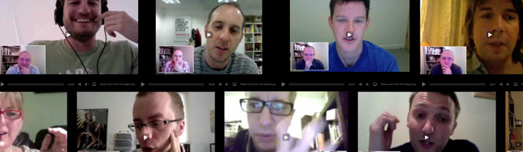

A couple of weeks ago I had the pleasure of doing some transcription [work](http://jpedroribeiro.com/portfolio/) for the podcast called "[Please start from the beginning...](http://psftb.ryanhavoctaylor.com/)", a video series exploring the career paths and experiences of web industry professionals.

## The Podcast

PSFTB (as I'll call it from here) is a project run by [Ryan "Havoc" Taylor](http://ryanhavoctaylor.com/), a British designer and developer that works at [Headscape](http://www.headscape.co.uk/) and also freelances at [Havoc Inspired](http://www.havocinspired.co.uk/). The weekly podcast interviews [amazing people](http://psftb.ryanhavoctaylor.com/interviews/) from the web design industry from all over the world.

## Transcribing, Learning, Enjoying

The [interview I transcribed](http://psftb.ryanhavoctaylor.com/design/naomi-atkinson/) was with the lovely [Naomi Atkinson](http://naomiatkinson.com/). She talked about her career, clients, being a freelancer and expectations for the future of the web industry.

It was a fun experiment and a good experience to me to transcribe an interview in English, as I'm not a native speaker of the language. I had a great time doing it and hopefully, if my schedule allows it, I'll do it again.

Check out this and other great interviews at [Please start from the beginning...](http://psftb.ryanhavoctaylor.com/).
