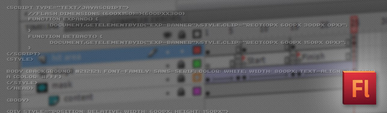
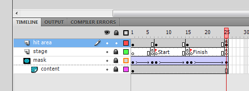

A very popular ad type in portals and blogs, the expandable banner is a useful technique to display more content to a banner. It's a very simple concept: the banner initially starts with a standard size and then increase when the user interacts (rollover or click) with it.

In this tutorial, we are going to create the expandable banner by following 3 steps:

1. Create a Flash banner with the original size and the expanded animation.
2. Build a expandable area for the banner with HTML & CSS.
3. Develop a small javascript to enable communication between the Flash banner and the HTML file.

## 1) The Flash Animation

Start by creating your animation in a canvas as big as the expanded part to be. In this example, my banner will expand from 600x150 to 600x300, so the latter is my canvas size.

We are going to use 4 layers (although you might use more if needed): _hit area_ - for our mouse events, _stage_ - as a guide, _mask_ - to hide and show different areas of the canvas and _content_.

In the **hit area**, we place a button with this actionscript:

on(rollOver)	{
  getURL("javascript:expand();");
  gotoAndPlay("Start");
}
	
on(rollOut)	{
  gotoAndPlay("Finish");
  getURL("javascript:retract();");
}
	
on(release)	{			
  getURL("http://www.jpedroribeiro.com/", "\_top");
}

As you can see we are going to call a **javascript** on these two mouse events that will expand and retract the flash area, the third event is the click which will take us to our desired link. In the **mask** layer, create a shape object and animate it to hide the extra content. Don't worry about the canvas size, we will take care of it next.

## 2) The HTML

We are going to use 2 DIVs here, the parent one with a set position and the child one containing the embedded Flash and using CSS to clip its area.

     
    
       
        <object>...</object>     
    
 

Now we just need some script to dynamically change those attributes.

## 3) Interaction

Finally, the JavaScript. Here we will set the CSS attribute _clip_ of the child DIV to 300px height when the user hovers our banner and 150px when he moves away from it.

function expand() {
    document.getElementById("exp-banner").style.clip="rect(0px 600px 300px 0px)";
}
function retract() {
    document.getElementById("exp-banner").style.clip="rect(0px 600px 150px 0px)";
}

To get a smoother result, you should only call the _retract_ function when your animation reverted back to its standard height.

## Demo & Source Files

Putting all together, you should come with something like this. [Check out the **demo page**](http://jpedroribeiro.com/wp-content/uploads/2011/06/expandable.html) and feel free to **download** the original [Flash file](http://jpedroribeiro.com/wp-content/uploads/2011/06/expandable.fla).
