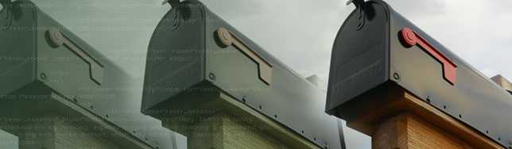

Creating a successful **e-mail marketing** campaign requires several items: a valid product or service to offer, selected target audience and, to make everything work, a fail-proof **html**.

## Old Style HTML

Coding for e-mail is completely different than coding [websites](http://jpedroribeiro.com/portfolio/). E-mail clients software render e-mails in different ways just as **browser**\-based e-mail services. The **HTML** for this media is mostly outdated, deprecated and messy, at least it will be if you want to make them work on all (or most) clients.

## What About CSS?

Most of the **CSS** you know is useless for e-mails, but depending on your target audience you might be able to go a bit further. **Campaign Monitor** keeps an updated table with the [current CSS support in e-mails](http://www.campaignmonitor.com/css/), so keep that page in your bookmark for future references.

## Tips to Code a Fail Proof E-mail

**Structure**: Put semantics aside and bring those <table> tags back. Since most of the styling won't behave as we want, we are going to have to use tables for positioning the design. Don't forget to set cellpadding and cellspacing to 0. **Images**: Use border 0 and display: block on every images, they avoid that extra spacing around the image, specially on Gmail clients. If you are using images inside table cells, add a background colour to the cell, since some users might have turned off images display (use alt tags as well). **Text**: Although some platforms will render css text styling, I recommend going back to the deprecated . You can use a styled inside the for modern clients.

## Test, Test, Test

After all is done, **test as much as you can**. You'll probably be fine if the e-mail work on Gmail, Hotmail and Outlook, so try to focus on those first. Providing a link to a **browser version** of the e-mail on the top (and bottom) of your e-mail is also a common standard.
