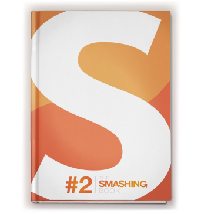

A couple months ago I finished reading [The Smashing Book 2](https://shop.smashingmagazine.com/smashing-book-2.html "Buy The Book") from the popular web design blog [Smashing Magazine](http://www.smashingmagazine.com/). Just like with the first book, I got disappointed. It **looks good**, it **feels good** (awesome printing), it covers a variety of topics, but to me it just doesn't work.

For starter, it feels like a bunch of **blog articles** put together. I can't feel the connection among them. Like I said, it covers a wide range of topics, from e-commerce to mobile, typography and print design. I found myself skipping several pages until finding something that I'm actually interested in. Too many different areas covered also means I won't use the [book](http://jpedroribeiro.com/tag/books/) as a quick reference. Maybe this was intentional so they could reach a broader audience, just a guess.

One chapter in particular covers **design patterns** in e-commerce based on a research with over 50 websites. Even though the content and results are well put together, this is hardly something I want to read in a book. It would make more sense to see it in a **magazine** as the results will become dated very fast.

**The Smashing Book 2** is not a bad book. It is well written and the authors go very deep into each chapter, they are very informative although not so useful in practise. The chapters cover a lot about strategy and theory.

It's a great improvement from their first try and I'm sure a lot of people will like it. It just isn't the book I was expecting considering what **Smashing Magazine** represents to the web community.
