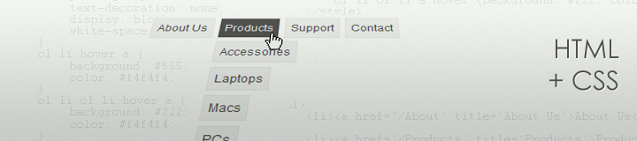

Drop Down menu is an excellent alternative for complex menus, the ones with a variety of categories and subcategories to choose from. In this article, I'll show how I usually code this kind of menu without using any javascript of back-end functionality.

## The Goal

We are going to aim for a simple usable menu with links and sub-menus. It will work on most browsers (IE, FF, Chrome, Opera) with graceful degradation on the outdated ones.

## The Markup

Our menu is an ordered list. Why ordered you ask? Well I'll consider this our main menu (on header > nav) so the items/links have a logic on its own. There is a meaning for placing 'About Us' before 'Contact' (even thought it's not numerical or alphabetical order). Therefore, it's an ordered menu.

So here it is:

<ol>
    <li><a href='/About' title='About Us'>About Us</a></li>
    <li><a href='/Products' title='Products'>Products</a>
        <ol>
            <li><a href='/Accessories' title='Accessories'>Accessories</a></li>
            <li><a href='/Laptops' title='Laptops'>Laptops</a></li>
            <li><a href='/Macs' title='Macs'>Macs</a></li>
            <li><a href='/Pcs' title='PCs'>PCs</a></li>
        </ol>
    </li>
    <li><a href='/Support' title='Support'>Support</a>
        <ol>
            <li><a href='/FAQ' title='FAQ'>FAQ</a></li>
            <li><a href='/VideoTour' title='Video Tour'>Video Tour</a></li>
        </ol>
    </li>
    <li><a href='/Contact' title='Contact'>Contact</a></li>
</ol>

## Styling

Now, the fun part. I will use some basic design styles just to make the menu more clear, but you can edit colours, fonts, sizes the way you want.

ol {
    font-family: arial; 
    font-size: 12px; 
    list-style: none; 
    margin: 0; 
    padding: 0; 
    position: relative
}
ol li {
    float: left; 
    margin: 0 5px 5px 0; 
    position: relative;
}
ol li a, ol li:hover ol li a {
    background: #f4f4f4; 
    border: 1px solid #eee; 
    color: #555; 
    padding: 5px; 
    text-decoration: none; 
    display: block; 
    white-space: nowrap
}
ol li:hover a {
    background: #555; 
    color: #f4f4f4;
}
ol li ol li:hover a {
    background: #222; 
    color: #f4f4f4;
}
ol li ol {
    left: 0; 
    position: absolute; 
    top: 26px; 
    padding-top: 5px; 
    display: none;
}
ol li:hover ol {
    display: block; 
    position: absolute

What basically is happening is that we are hiding the second level menu via _display:none_ and showing it when the user hovers over the parent list item (last style declaration).

### IE7

As always, there's a bug on IE7 where you have to set a background to an object in order to handle the _:hover_ selector. This happens on objects that have position: absolute, which is the case of our menu. To fix this, the easiest way is to add a fake image to it, like:

<!--\[if lte IE 7\]>
    
<!\[endif\]-->

### IE6

Sadly, IE6 can't handle :hover on list elements. There are some hacks and javascript to enable it but I prefer to use another approach and just show it like a simple menu for these users. In this conditional comment, we will be resetting the "mouse over" effect to the anchor element instead.

<!--\[if lte IE 6\]>
    
<!\[endif\]-->

## Conclusion

You can use different properties on the :hover state, like visibility, left and top positioning and also add css transitions to make the change smoother, but our goal was to do something simple, a base where you can build upon. One drawback of using a drop down menu is that you can "hover" over elements on a touchscreen device. That's why we make all items of our menu link to a page, so if the user can't hover to see the product list they can still navigate through our site.

[**VIEW DEMO**](http://jpedroribeiro.com/wp-content/uploads/2012/01/css-only-drop-down.html)
