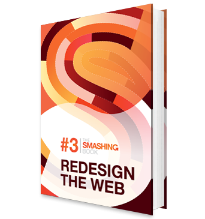

Well, I guess third time's the charm because [Smashing Magazine](http://www.smashingmagazine.com "Smashing Magazine") finally made it. Their third volume hits the nail on all chapters and it's just a joy to read.

## Redesign The Web

If you read [my review](http://jpedroribeiro.com/2012/01/book-review-smashing-book-2/ "Book Review: Smashing Book 2") of their previous [book](http://jpedroribeiro.com/tag/books/ "Tag: books") you'll understand why I had low expectations on this one. Gladly, it surprised me from the beginning. The whole book had a theme - **Redesign the Web** - and all topics were somehow connected.

The authors and the mood of the writting is changed as well. It feels more personal, like a friendly talk with some really smart guys.

## The Content

Being a **front-end developer**, I was eager to see what they were going to publish about [html5](http://jpedroribeiro.com/tag/html5/ "Tag: html5"), [css3](http://jpedroribeiro.com/tag/css3/ "Tag: css3") and [javascript](http://jpedroribeiro.com/tag/javascript/ "Tag: javascript"). It's hard to approach subjects dense like these in just a few pages, but they manage to do it well. I liked the way they introduced content and concepts that are easy to understand if you are a **beginner** but just a couple of lines later they pump it up so **advanced users** can see the complex side of the same situation.

The **CSS** part is genius. My favourite part was an example on transitions that featured racing horses. But the best chapter in the book, personally, is the one on Javascript. [Christian Heilmann](http://christianheilmann.com/) will teach you how pure **javascript** can sometimes be better than **jQuery**. This is mind-blowing and every front-end developer should read it.

Another part that deserves mention is the one on **Photoshop**, although I'd like to see more screenshots among the content. Nonetheless, it's another great chapter. One of the great tips they wrote is about using Photoshop slices for **css sprites**. I never thought about that and it makes perfect sense!

## You Want Need This Book

With a new approach and a refreshed idea, the [Smashing Book 3](https://shop.smashingmagazine.com/smashing-book-3-printed-and-or-ebook.html) is definitely a book I **recommend**.
