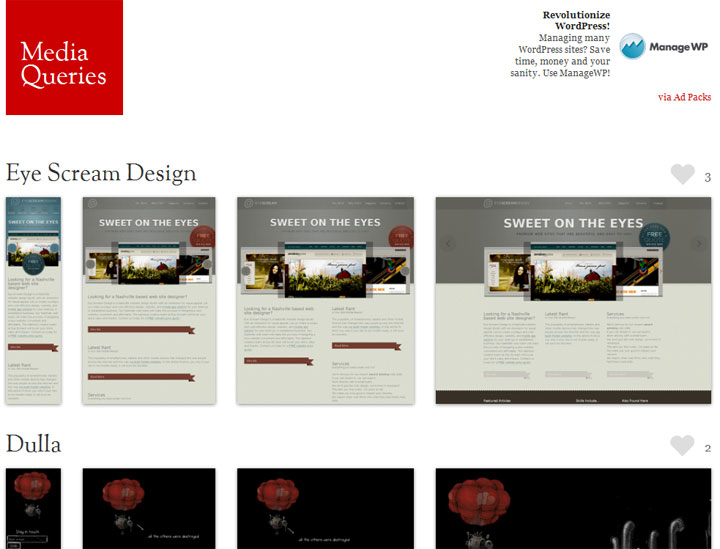

Mobile, tablets, netbooks... today people access websites using a variety of computers and gadgets and that is great, it enable us to reach more people and develop more tools for these **new devices**. However, due to the wide range of configuration and screen sizes, it can be a bit hard to manage **web design** and **usability**.

To help us, [CSS3](http://jpedroribeiro.com/tag/css/ "Posts about: CSS") has a feature called [Media Queries](http://jpedroribeiro.com/tag/media-queries/ "Media Queries") which basically enables us to apply different **styles** to different devices, with just a couple lines of code.

## Who's Using It?

My first contact with Media Queries was when reading [Andy Clarke](https://twitter.com/#!/malarkey)'s book [Hardboiled Web Design](http://stuffandnonsense.co.uk/blog/about/hardboiled_css3_media_queries/) (highly recommended!), from there I discovered that this technique is not as new as I thought and a lot of cool and smart people have been using it for a while.

For first timers, I advise having a look at the website **gallery** [mediaqueri.es](http://mediaqueri.es/) and just browser around on their selections (you can learn a lot by viewing other people's code).

## Basic Functionality

When I was redesigning this site I decided to use Media Queries. This is, of course, my first experiment on the subject so there's always room for improvement. This is how I did it:

So, the code I use is the following:

<link rel="stylesheet" media="screen" href="/style.css">
<link rel="stylesheet" media="only screen and (min-width: 320px) and (max-width: 767px)" 
    href="/mobile.css">  
<link rel="stylesheet" media="only screen and (min-width: 768px) and (max-width: 978px)" 
    href="/tablet.css">

**First line** is the basic stylesheet, the one loaded for most screen sizes. On the **second line** things start to get interesting. On the attribute _media_ I'm specifying a screen size range that fits most mobile, hence the filename "mobile.css". The **third line** follows the same logic, this time for tablets (or netbooks).

### Testing

To test how Media Queries affect this [site](http://jpedroribeiro.com) just resize the browser window. You will be able to see the 3 different stylesheets in action.

### Walkthrough

Since the lines are going to be read in order, the browser will the stylesheet widh no conditionals (styles.css), after that it will test the screen size and apply other stylesheets if necessary. Inside mobile.css and tablet.css I rewrote the styling of some layout elements, like the menu, footer, etc. So when the browser picks one of these files it will make the necessary changes in the layout.

### On File To Rule Them All

If you prefer to use only **one css file** to avoid multiple HTTP requests and [speed up your site](http://jpedroribeiro.com/2009/09/3-image-techniques-to-speed-up-your-website/ "3 Image Techniques To Speed Up Your Website"), you can apply the Media Queries rule directly on the stylesheet:

@media (min-width: 320px) and (max-width: 767px) { /\* Insert CSS code here \*/}

## Mobile First

Since mobile is growing stronger everyday and mobile users are usually under a download cap, or maybe bad reception, it is wise to apply the mobile CSS first and then the other ones. This idea is shared among several people including the guys at [320 and up](http://stuffandnonsense.co.uk/projects/320andup/). I do believe it is a smart approach but I have not quite found the perfect config for this site, so have a look and see if it fits your project.

## Going Further

If you want to go deeper, here is a [couple](https://developer.mozilla.org/en/CSS/Media_queries) [links](http://reference.sitepoint.com/css/mediaqueries) I recommend on this subject. Also, W3C has [a page](http://www.w3.org/TR/css3-mediaqueries/) regarding Media Queries, it's quite complex but worth the look.
