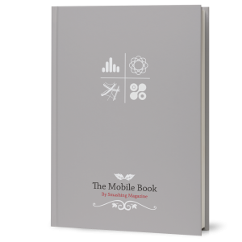

Mobile development, responsive web design, flexible layouts for devices. There are so many posts, articles and [books](http://jpedroribeiro.com/tag/books/ "Tag: books") coming out about this subject at the moment that is hard to follow. It's definitely the trending topic of the moment in the **web design** business and the reason it's pretty clear: more and more people are using their **mobile** devices as main way of browsing the web.

In this scenario, a new **book** arrives: [The Mobile Book](https://shop.smashingmagazine.com/the-mobile-book.html), a Smashing Media publication.

Personally, I was excited since the begining. After two [below the average books](http://jpedroribeiro.com/2012/01/book-review-smashing-book-2/) and an excellent [third installment](http://jpedroribeiro.com/2012/06/book-review-smashing-book-3/), they managed to keep the pace of the latter and brought to the shelves a vast and comprehensive book. Just like the ones before, the **Mobile Book** reaches a broad audience. Its subjects go from design, ux and development, to business, market and statistics.

## The Mobile Market: Numbers and Analysis

This chapter was to me the most interesting one. On one side it's filled with **data and statistics** that will soon be outdated. But on the other side, it's this kind of data you need to **understand** before making decisions on your projects. The author also talks about 'mobile' in terms of different devices connected (with or without screen). It's an overview of current experiments and future ideas, giving a glimpse of how interconnected devices will be in a near future.

## Responsive Web Design

This part of the book will please you depending on how much have you been reading about the subject lately. It doesn't have anything new that you couldn't find in most **articles and blog posts**. Also, as much as I like Ethan Marcotte and respect his work, it feels like there is an obligation to mention his name every time we talk about RWD. I know he coined the work in [that ALA article](http://www.alistapart.com/articles/responsive-web-design/), but it's been 2 years already.

## Design, Patterns & UX

I agree with the author when I read that we should "let the content define the break points of **media queries**, not the device width" and also when he advices "do not hide content or navigation from small screens". In both cases I reckon it's also important to have a look at the **commercial side**, since in the end we are here to make money.

The mobile UX and embracing the unknown. It's funny to realise how little we know about the average user (if there's such a thing like it) and the vast amount of possibilities and canvas to design for. The author also showcases several sketching and prototyping techniques including colaboration and interface origami (!).

## Mobile Optimization and Performance

Since mobile site optimization IS the same as desktop optimization it means this chapter could be part of any book, couldn't see anything new or exclusive to mobile. There are, however, some interesting techniques on cache and server side feature/browser detection that are worth looking.

## Conclusion

The Mobile Book is as generalist as Smashing Magazine, which is a great thing. I am a strong believer that web professionals should trive to be open minded and embrace the different sides of our business and this book fits perfectly with this point of view. You can find it at [the-mobile-book.com](https://shop.smashingmagazine.com/the-mobile-book.html)
