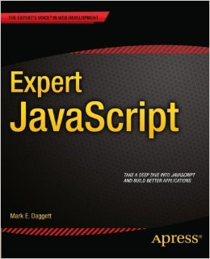

Being a frontend developer means not only knowing your tools pretty well but also understanding how and why they behave the way they do. JavaScript is a language that is very easy to get started but is actually more complex than it looks. That's the approach of Mark Daggett on the book [Expert JavaScript](http://markdaggett.com/blog/2013/11/28/introducing-expert-javascript/).

## A Conversation About JavaScript

What I really liked about this book is that it brings a very personal touch to a very technical book. [Mark](https://twitter.com/heavysixer) promptly states that it is a compilation of his favourite topics, like a collage of side notes. Similar style used by Crockford's ["The Good Parts"](http://shop.oreilly.com/product/9780596517748.do).

The topics range from objects to prototype, nodebots to unit testing. Each is very well written with just the right amount of complexity to cater for the more experienced coders.

## Conclusion

**Expert JavaScript** is a perfect choice of book for those moments when you need to see the language you use everyday from a different angle. Sometimes you'll revisit concepts you already know and sometimes you'll have to re-read the same chapter over and over to digest all the information available.

The book is available at [http://www.apress.com/9781430260974](http://www.apress.com/9781430260974).
