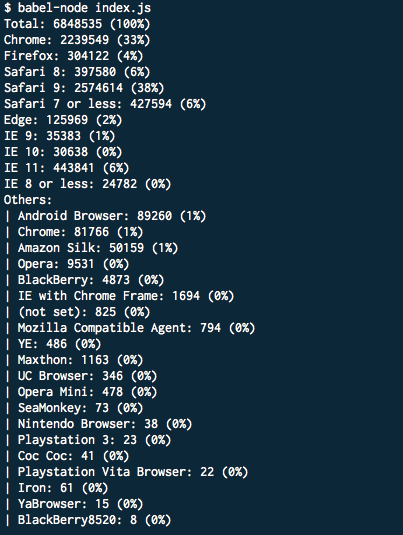

I love **Google Analytics** but the browser usage stats always annoyed me. Since modern, evergreen browsers release features very frequently, you end up having to combine multiple entries into one in order to get a more usable data. For example, when identifying the users on Chrome, I really don't care how many of them are on Chrome 48 vs 49, I only care if they are on Chrome.

To solve this, I created a small **Node.js** app called [Rapid Reporting Device Dashboard](https://github.com/jpedroribeiro/r2d2), or [r2d2](https://github.com/jpedroribeiro/r2d2) for short (yes I really wanted to create an r2d2 acronym).

It uses the Google Analytics API to connect to your dashboard. Reads the browser stats from the last 30 days and prints out in an _aggregated_ manner. The rules are, of course, very customised to my needs but the code itself is very easy to change if you need a different output.

I wrote it using some **ES2015** features like: `let, const, import` and `template strings`. It's all up on [GitHub](https://github.com/jpedroribeiro/r2d2) so feel free to have a look.
