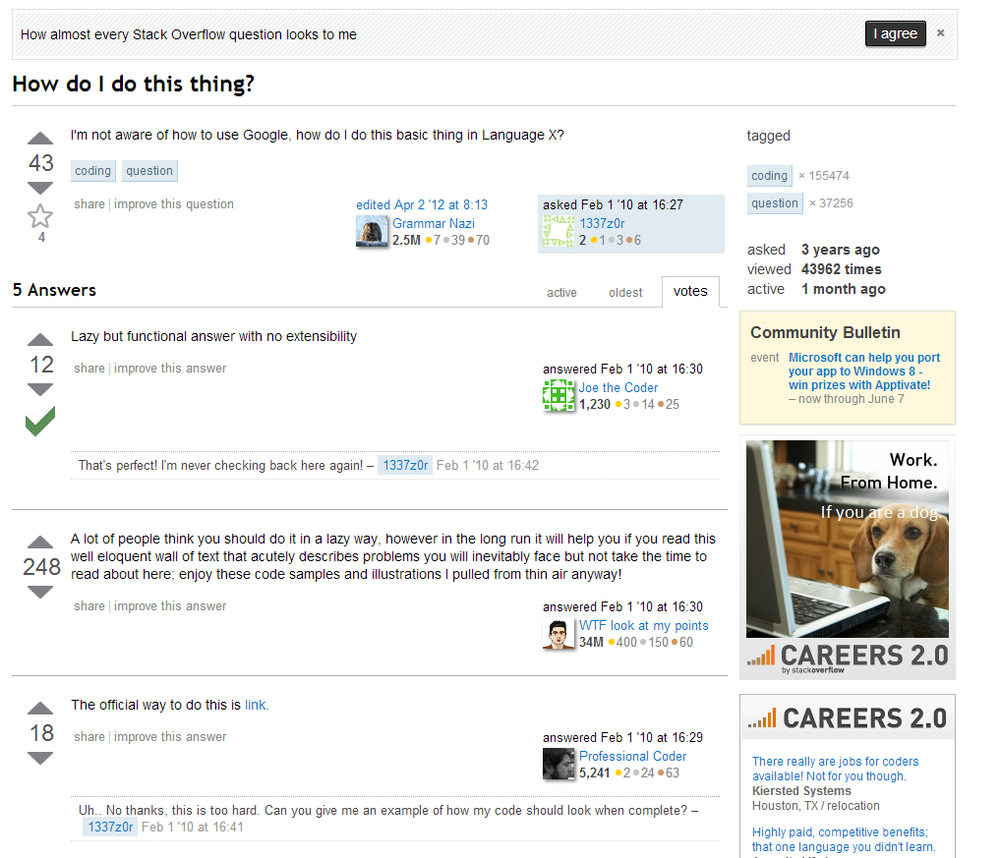

It's Sunday morning. I've just read some articles on [CSS](http://jpedroribeiro.com/tag/css/) and for some reason started browsing Stack Overflow on that subject, specifically on the [unanswered questions page](http://stackoverflow.com/unanswered/tagged/css). Clicked a few links, answered a couple questions. Got some nice **feedback**.

## Learning Platform

This month's [Start Your Shift](https://twitter.com/hashtag/startYourShift) is asking us to write about **Web Education**. As usual, it's a very broad subject and it's hard to find a point of view that has not been done before. Being fresh from my Stack Overflow experience, I thought: _could that website be a platform of education?_

**Kind of.**

## Quality of Content

It's all about the quality of answers. There is a good chance that your issue might be solved by an **experienced user** who will not only give you the solution but also provide the explanation. That's the most optimal experience you can have. You learn from it and the user gets points for being helpful. [Gamification](https://en.wikipedia.org/wiki/Gamification) at its finest.

Of course, it's not always like that:  And to be honest, most of the content over there **is** on this level.

## Carry On

Even with all its flaws, Stack Overflow could still be used as a **learning platform**. No matter how thin or superficial an answer is, it's a start. It's up to the user to carry on with that piece of **knowledge** and move on to deeper waters.

## Conclusion

The **Web** is an environment that is trying to catch your attention on every click. A website that functions as a learning and sharing platform will succeed with if it behaves in a similar manner. I know it works for me. As a **web developer**, there's nothing better than solving a bug by getting an answer on Stack Overflow.

Whether you `copy/paste` or learn from it it's up to you.
