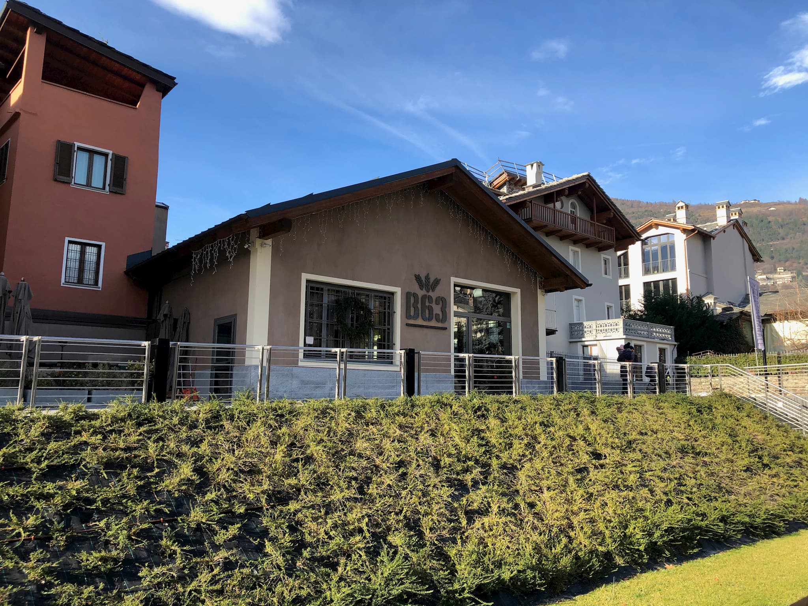

During my Christmas break I left the never ending overcast skies of London for the sun and (really) cold weather of the [Valle d'Aosta](http://www.lovevda.it/en), in Italy.

The region is known for its wine. In fact, it's home to the **highest elevated vineyards** in all of Europe.

So you can imagine my surprise when I discovered B63's _brewpub_ tucked away in a small square ([Piazza Caveri](https://www.google.com/maps/search/Piazza+Caveri+/@45.7371359,7.3158384,17z/data=!3m1!4b1)) between the main cathedral and Aosta's highstreet. 

## The Brewery

Birrificio B63, specializes in _German style_ beers in a very small scale of 500L per cycle. It's as artisanal as it gets. They offer guided tours and tasting sessions - although you might want to give them a call as their website is not the most up to date.

The brewpub was busy most of the time and the staff was very friendly - even when some words got lost in translation. 

Most people coming over seem to be more interested in the **food**. In fact, there was not many seats for _drinkers_ (I counted 3 tables). The food is really good and it's a good option against the touristy eateries in the near high street.
 
## The Beers

I started my tasting with their lager beer called **Swing** (<a href="https://untappd.com/user/jpedroribeiro/checkin/846823979" class="beer-rating"><b>3.75</b>/5 on Untapped</a>). 

It's a _helles_ style beer (remember the German influence I mentioned earlier?), very clean & clear, lightly hopped. Flavour-wise it's almost herbal. Not as full bodies as I'd expect for a helles. Surprisingly sessionable for a 5.7% ABV.

This was my favourite of the day, **Reggae** (<a href="https://untappd.com/user/jpedroribeiro/checkin/846826204" class="beer-rating"><b>4.25</b>/5 on Untapped</a>). 

Their _IPA_ was unfiltered. Creamy head, amber to almost red colour. Hoppy but not _west-coast_ hoppy. Still some malt there to balance out. Fruity notes.

Their darkest option, **Soul** (<b>3.50</b>/5). 

Being German influenced it's not surprising that their dark beer is a  _Schwarzbier_. It was slightly sweet as expected. Full bodied, and with a thick, creamy head.   

## Conclusion

[B63](http://www.birrificio63.it/) is definitely a great stop if you're strolling around **Aosta**. Good food and good beers with a very reasonable price.

In a region so rich in wine options, it's good to know that the **beer culture** is striving. After vising B63 I've learned that there was another brewery I could've visited called [Les Bières du Grand St. Bernard](http://www.lesbieres.it/en/shop/). I've seen some of their bottles in shops around town but never thought it could be local. 
Maybe next time I'll have to stop by and check them out. 
