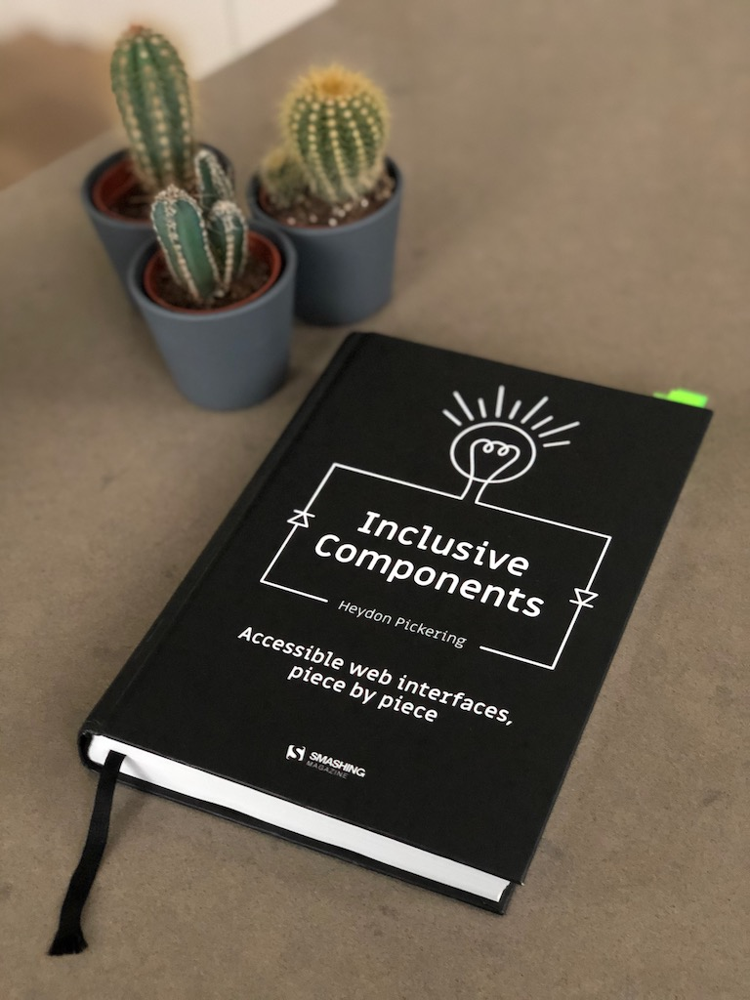

Accessibility. 

If you work with web development you must've heard about this term lately. 

It is becoming popular topic on conferences & meetups - whether it's driven by [money](https://karlgroves.com/2019/08/27/the-truth-about-the-roi-of-web-accessibility) (an accessible website mean more people can use your product), [law](https://en.wikipedia.org/wiki/Web_accessibility#Web_accessibility_legislation), [empathy](https://medium.com/cbc-digital-labs/developing-empathy-the-importance-of-digital-accessibility-workshops-18e40d79932a), or simply because of **common sense**.

On that wave comes [Inclusive Components - Accessible web interfaces, piece by piece](http://book.inclusive-components.design/), by [Heydon Pickering](https://twitter.com/heydonworks). The book is a comprehensive **guide** on creating web components with **accessibility** in mind. 

## The Book

The first thing you notice about the book is that it has the [Smashing Magazine](https://shop.smashingmagazine.com/) _quality standard_, both in terms of aesthetics and content. 

Throughout **12 chapters**, each dedicated to a specific type of component, the author explains in details how to create
 an accessible user interface from the most basic implementation to the most complete and advanced solution - not forgetting the steps in-between.
  
It's in the chapter progression that the author excels in creating an engaging and **educational** writing. As the chapter evolves, so does the component in focus, with new building blocks being added to
 it. It's an approach that caters for a wide range of readers with different skill sets. 
 
JavaScript wise, it's unbiased towards frameworks (React and Vue are mentioned). In fact, most of the code samples are _framework-free_. Sometimes no JavaScript solutions are offered, as a display that the web is inclusive by nature.

Visually, the book is simple and beautiful. Perfect binding, high quality paper, and a fabric **bound bookmark**. I cannot stress enough how much I like this book just for the fact that it has a bound bookmark. Tiny details count, people.

## Some Highlights

A theme that is present throughout the book is the fact that you might have to write your code for different audiences. A user accessing your website with a screen reader and one using a mouse and cursor might need different elements to be present on the page.

We can cater the screen readers audience by hiding aesthetic elements with `aria-hidden="true"` or visually hide verbose elements for the mouse/touch crowd with a custom class like the one below:

    .visually-hidden { 
        position: absolute !important;
        height: 1px; 
        width: 1px;
        overflow: hidden;
        padding: 0;
        border: 0;
        clip: rect(1px, 1px, 1px, 1px);
    } 

This is a better approach than simply `display: none` as the latter would remove the element from the visual interface and screen reader output.

Another interesting tip is to not allow non-interactive elements to have focus, which makes sense considering that an element that is focusable means it will also have some sort of feedback when interacted with

## Conclusion

As you can see by my bookmarks, this book has tons of useful tips. I've been doing web development for years now and after reading it I felt like I needed to refactor _all the things_.

I'll end this review with a great quote from the book:

> “Inclusive design mantra: If in doubt, spell it out.”

If you don't get it. [Go get a copy of the book](http://book.inclusive-components.design), you won't regret it.
