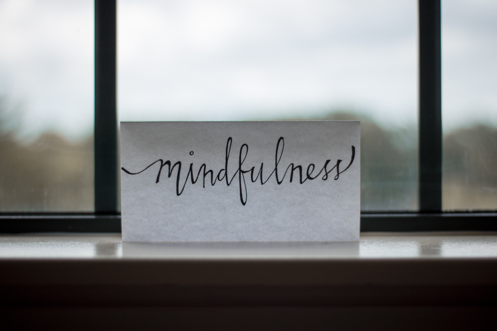
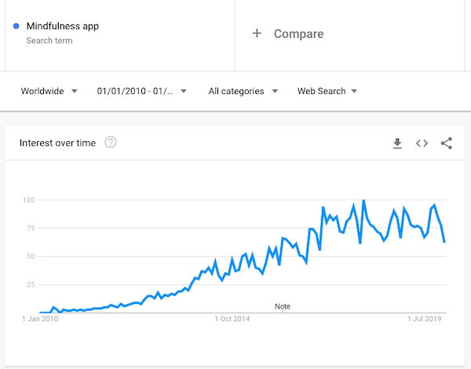
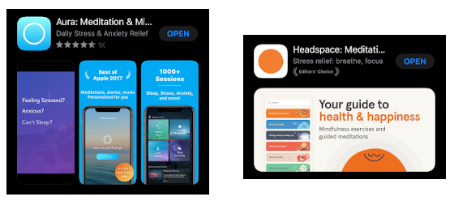

 
I always had some interest in **meditation**. 

In the past, I played around with the idea via **yoga** classes. It was a mix of positions, breathing exercises
and some sort of meditation. 

However, my goal at time was purely focused on the physical benefits that yoga would bring to me. Mindfulness was not even in the picture.  

In fact, _mindfulness_ was not even I word I was aware of. 

Fast-forward to a few years, the [trend](https://trends.google.com/trends/explore?date=2010-01-01%202020-01-01&q=Mindfulness%20app) of meditation or mindfulness apps has peaked (over 100 apps last time I checked), and meditation _on the go_ has never been so easy.

So, I decided to give it a go to see what being _mindful_ means, and how would it change me (if at all).

## The Plan

In a nutshell, my plan was: 

1. **Use a meditation (or mindfulness) app throughout the year**.  
2. Log some key moments. 
3. Report my findings (I am an engineer, don't judge me 🤷🏽‍♂️).

Time-wise, what worked best for me was to use it in the mornings, after the gym, just before work.

I started doing this **every single day**. After about 3 months, I've stuck to work days only - with an occasional session on weekends.   

## The Apps

After some consideration, I decided to go with [Aura](https://www.aurahealth.io/) & [Headspace](https://www.headspace.com/). Mainly because I had an extended trial for both that would allow me to fully use their app without the **free tier** limitations.

## The Good, the bad & the ugly

### Gamification

**Aura** uses _day streak_, which makes no sense to me. 
It only serves to pressure the user in using the app for the sake of it and induces **anxiety** rather than mitigates it.

**Headspace** takes it easy and only tracks _total minutes meditating_. It feels positive regardless of what that number means to you.

### Day to day use

**Aura** has loads of instructors. Each tackling different topics ranging from gratitude to life stories.

**Headspace** feels more like a continuous learning experience. The tracks (mostly) have an end goal. Like chapters on a book.

I found that Aura was best for **one-offs** - that moment when you just need to sit down and get it going. 

### Quality Control

**Aura**, due to its variety of instructors, has poorer quality standards compared to **Headspace**.

I've notice the **audio quality** dropping to a very low level and there was also one session where the instructor literally **coughed** as they were giving the instructions - why wasn't that edited out is beyond me. 
<small>(Now, it's fair to notice that in total these might've been about 5-6 sessions throughout the whole year, so their quality _average_ is still pretty good.)</small>

### Other notes

- I've noticed there's a lack of proper **offline** support in Aura, even for tracks you _liked_. Headspace, if I'm not wrong, lets you re-listen to previous sessions.
- Headspace logged me off constantly. I think that happened on every app update.
- Aura had a nice feature of adding **background white noises** during a session. Great for relaxation.
- Both apps have some sort of **community** feel. Headspace has group meditation session which is quite interesting although I've only really done it a couple times.

## Conclusion

Taking the time to gather your thoughts and be mindful, even for a few minutes a day, does work. At least it did for me.

>> I've noticed the biggest change in the first 2-3 weeks. 

After that, it became a habit. Part of my day to day routine. Not task that I **had to** do, but a moment I looked **forward to**.

After **1 year** with these apps I am looking for something **different**. At the moment I'm giving [Waking Up](https://wakingup.com/) a try. I've listened to **Sam Harris** in a few podcasts and he seems to be someone who knows a thing or two about meditation. I'll report back in the future.

### Which one should you pick?

I hate to say _it depends_, but it does.

If you have never done mindfulness before and just want to have a taste of it, go for **Aura**. Have a couple sessions and see how you feel.

If you want to **learn** and have a longer term guidance, pick **Headspace**.

**Maybe try both**. Try other apps if you can. 

Either way, go for their free tier version first. And then, when you're ready to commit, subscribe. You'll get much more features on a **paid** tier.

#### _PS:_

- <small>I've interchangeably used mindfulness and meditation throughout this article for brevity. They're [different things](https://medium.com/thrive-global/mindfulness-meditation-whats-the-difference-852f5ef7ec1a)</small>. 
- <small>It might seem obvious but it's worth noting that everything written here is solely based on **my** experience, and yours may vary</small>. 
- <small>None of these companies paid me to write anything</small>. 

