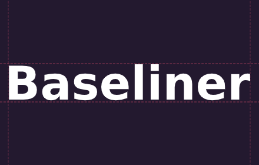
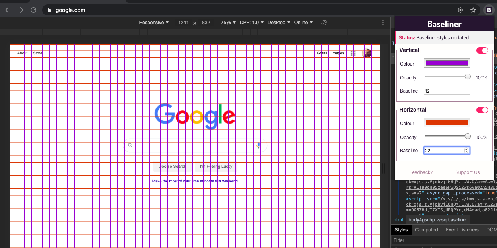

 
[Baseliner](https://chrome.google.com/webstore/detail/baseliner/agoopbiflnjadjfbhimhlmcbgmdgldld?hl=en-GB), my very own Chrome Extension has finally been published.  

## An extension for designers and developers who care about grid alignment

Born in 2015, **Baseliner** is a Chrome (and [Firefox](https://addons.mozilla.org/en-GB/firefox/addon/baseliner-add-on/)) extension used by more than **6.000** users worldwide. 

The extension overlays a grid on top of any page, helping UX Designers & Developers build interfaces with pixel perfect metrics.

## Version 6.0

The newly deployed version 6.0 was completely built from scratch, based on the feedback I've received over the years.

**Baseliner** now enables both horizontal **and** vertical grid, by far the most requested feature.

The extension is also faster and more performant thanks to the use of more modern tooling like React.js.

[Download Baseliner 6.0 on Chrome Web Store](https://chrome.google.com/webstore/detail/baseliner/agoopbiflnjadjfbhimhlmcbgmdgldld?hl=en-GB)

[Download Baseliner 6.0 for Firefox](https://addons.mozilla.org/en-GB/firefox/addon/baseliner-add-on/)

## Feedback, bugs, suggestions, support

The project is on [GitHub](https://github.com/jpedroribeiro/Baseliner) and we welcome any suggestions that will help us improve this tool.
Found any bug? Feel free to file an [issue](https://github.com/jpedroribeiro/Baseliner/issues/new/choose).
Like the extension? You can [buy us a coffee](https://ko-fi.com/jpedroribeiro) and help maintain this project.