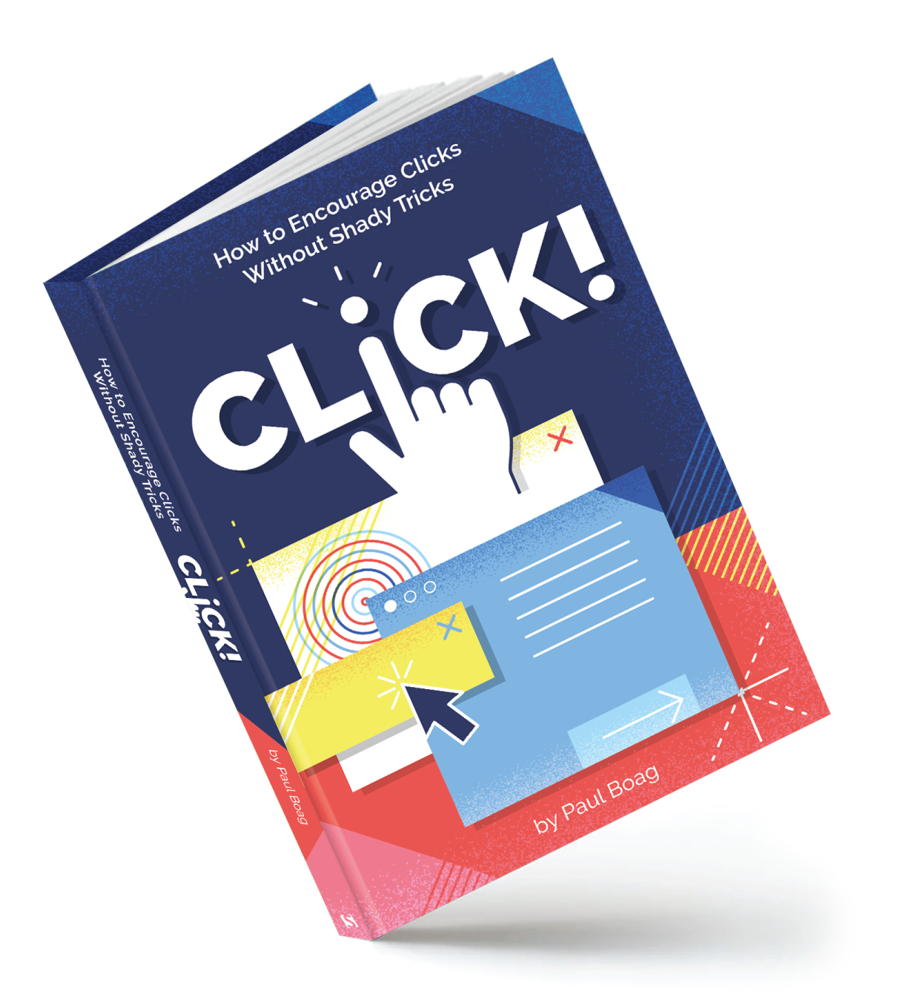

I'm an engineer. I like going straight to the point and find an answer to a problem. 

That's why I'm usually put off by books on business. All that jargon and rhetoric puts me off. 

[Click!](https://www.smashingmagazine.com/printed-books/click/), on the other hand, it's different. Conversational, educational, personal. It shows that _conversion rate_, _KPIs_, and _sales funnel_ can be more than office lingo and more like real concepts to make your site or business great.

## The Book

Easy reading and entertaining. That's how I'd summarize it. One of those books you could read on a (long haul?) flight if anyone were still flying anywhere.

The chapters reach a wide variety of topics. When talking about design and usability, for example, we see topics talking about **dark patterns**, **empathy**, and **cognitive load**. 

Others lean into the analytics side, where the focus is around a/b testing and gathering user data.
To me, this is where the **book thrives**. It's just enough content from a field that might not be your own to keep you interested. It does, however, levels down to basic/intermediate level, and some content might seem common sense to you. However, but by using this approach the author keeps the content engaging and useful for people from all business sectors. 

## Some Highlights

Another great thing about this book is the stories Paul Boag share. Some are quite unbelievable:

> "...it turned out every single person we tested that day had never user a mouse."

Which, If you have ever done user testing before, you might find it quite relatable.

The chapter on measuring conversion is full of gems like this: 

> "Is a long session an indication the user is engaged, or that they have left the browser window open and gone to make a cup of tea?"

When talking about **trust**, the author tell us a story of an interesting use-case he faced, and the solution:

> "By referring to 'students' instead of 'you' and the 'University of Essex' rather than 'we', it actively puts up a barrier between the reader and the writer. That does nothing to build trust." 

## Conclusion

With real life examples, comprehensive range of topics, and a direct approach to common business problems, [Click!](https://www.smashingmagazine.com/printed-books/click/) is an easy reading book packing great value.

Definitely recommended for anyone working on a commercial website. 

[Grab a copy of the book](https://www.smashingmagazine.com/printed-books/click/), and make sure to pass it around the office.
