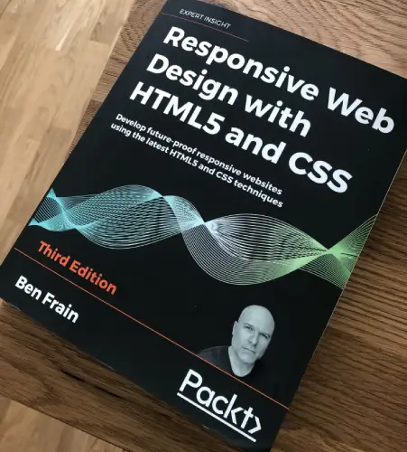
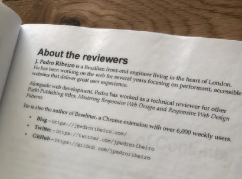

Over the past several months I've been working with [Packt Publishing](https://www.packtpub.com/) as a technical reviewer for their new release: [Responsive Web Design with HTML5 and CSS - Third Edition](https://www.packtpub.com/gb/web-development/responsive-web-design-with-html5-and-css-third-edition).

I've previously [shared my experience working as a tech reviewer](/2015/07/being-technical-book-reviewer/), in fact, I've reviewed their 1st edition back in 2015.

This new edition is beautifully written by [Ben Frain](https://benfrain.com/), in a very informal, joyful way. The kind of book I wish I had when I started my journey as a web developer.

You can check out more about the book on the [Packt Pub website](https://www.packtpub.com/gb/web-development/responsive-web-design-with-html5-and-css-third-edition).