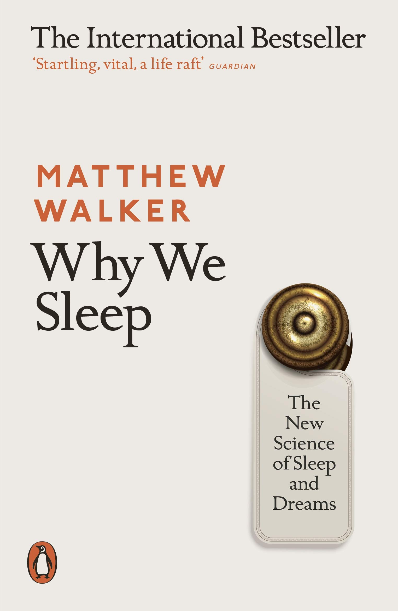

Never thought I'd be reading and enjoying a book about sleeping. Insightful, and oddly entertaining. And yes, I do get the irony of reading a book about sleep after going through [some books on coffee](/tag/coffee/) 🤷🏽‍♂️

A **5-star** rating on [my GoodReads](https://www.goodreads.com/user/show/3186522-j-pedro-ribeiro).

Here are my _highlights_:

1. (On different types of body cycles) If I were to keep you awake all night, your **core temperature** would still show the same pattern. `(pg.19)`
1. (...) melatonin helps regulate the _timing_ of when sleep occurs by systematically signaling darkness throughout the organism. But melatonin has little influence on the generation of sleep itself. `(pg.22)`
1. For every day you are in a **different time zone** your suprachiasmatic nucleus can only readjust by about one hour. `(pg.24)`
1. The longer you are awake, the more **adenosine** will accumulate. `(pg.26)`
1. You can artificially mute sleep signal of adenosine by using a chemical that makes you fee more awake: **caffeine**. `(pg.26)`
1. Individuals who are deliberately **fasting** will sleep less as the brain is tricked into thinking that food has suddenly become scarce. `(pg.66)`
1. (...) migrating birds will grab brief periods of seep lasting only seconds in duration. `(pg.66)`
1. (...) _NREM_ sleep helps transfer and make safe newly learned information into **long-term** storage sites on the brain. `(pg.74)`
1. _REM_ sleep can (help define what) a collection of information **mean as a whole**, not just as facts. We can awake the next morning with new solutions to previously intractable problems or even be infused with radically new and original ideas. `(pg.75)`
1. Sleep is not the absence of wakefulness. `(pg.108)`
1. (...) the more sleep spindles an individual has at night, the greater the restoration of overnight learning ability come the next day. `(pg.111)`
1. The second benefit of sleep for **memory** comes after learning (...), consolidation. `(pg.112)`
1. (...) **emotional** regions of the brain are up to 30% more active in REM sleep compared to when we are awake. `(pg.193)`
1. (...) **REM sleep** is the only time during the twenty-four hour period when your brain is completely devoid of this anxiety-triggering molecule (noradrenaline). `(pg.206)`
1. (...) REM sleep dreaming accomplishes 2 critical goals: remember (...) and forget. `(pg.206)`
1. (...) **alcohool** will often suppress REM sleep, specially during the first half of the night. `(pg.270)`
1. (On alarm clocks) The **snooze** feature means that you will repeatedly impose a cardiovascular spike again and again within a short span of time. `(pg.278)`

Liked this post? Read my other [book notes](https://www.jpedroribeiro.com/tag/book-notes/).
