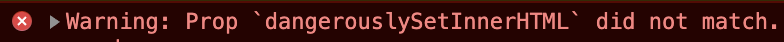
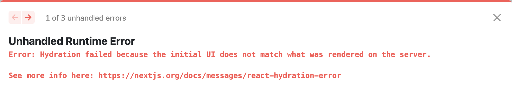
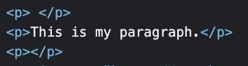

This is an issue I come across every once in a while and it always takes me a couple hours to figure it out.

## Replicating the issue
Let's say you have a **React.js** component that will render a paragraph of text coming from a <abbr title="Content Management System">CMS</abbr> and that content can have HTML tags in it, like a <abbr title="What You See Is What You Get">WYSIWYG</abbr> editor.

```jsx
// MyTextComponent.js
function MyTextComponent(props) {
  return <p dangerouslySetInnerHTML={{ __html: props.content }} />;
}

// App.js
function App(props) {
  return (
    <div>
      <MyTextComponent content={props.content} />
    </div>
  );
}
```

The browser renders what you expect:


However, there's that **warning** in the console that says:

```
Warning: Prop `dangerouslySetInnerHTML` did not match. Server: "" Client: "<p>This is my paragraph.</p>" 
```
If you're using **Next.js**, you will get a nicer error message:



## What causes this warning?

On  my example, the content passed to the component was `<p>This is my paragraph.</p>` which would be fine considering that we are using `dangerouslySetInnerHTML` to render the content. 

However, the component is already wrapping the content in a `<p>` tag which, according to the [HTML Spec](https://html.spec.whatwg.org/multipage/dom.html#phrasing-content), should only contain [phrasing content](https://developer.mozilla.org/en-US/docs/Web/HTML/Content_categories#phrasing_content). 

The spec also [says](https://developer.mozilla.org/en-US/docs/Web/HTML/Element/p#:~:text=Paragraphs%20are%20block%2Dlevel%20elements%2C%20and%20notably%20will%20automatically%20close%20if%20another):

> Paragraphs are block-level elements, and notably will automatically close if another

Here is a CodePen that illustrates and replicates this condition more clearly:

<iframe height="300" style="width: 100%;" scrolling="no" title="Invalid nested paragraph tags" src="https://codepen.io/jpedroribeiro/embed/XWBXXPo?default-tab=html%2Cresult" frameborder="no" loading="lazy" allowtransparency="true" allowfullscreen="true">
  See the Pen <a href="https://codepen.io/jpedroribeiro/pen/XWBXXPo">
  Invalid nested paragraph tags</a> by Pedro Ribeiro (<a href="https://codepen.io/jpedroribeiro">@jpedroribeiro</a>)
  on <a href="https://codepen.io">CodePen</a>.
</iframe>

If you inspect the rendered paragraph, you will see the following:



Which doesn't match what the server rendered `<p>This is my paragraph.</p>`.

## How to fix it?

One solution is to change the wrapping element to a `<div>` instead of a `<p>`.

```jsx
// MyTextComponent.js
function MyTextComponent(props) {
  return <div dangerouslySetInnerHTML={{ __html: props.content }} />;
}   
```

The main point is to ensure that the rendered content is valid HTML. 