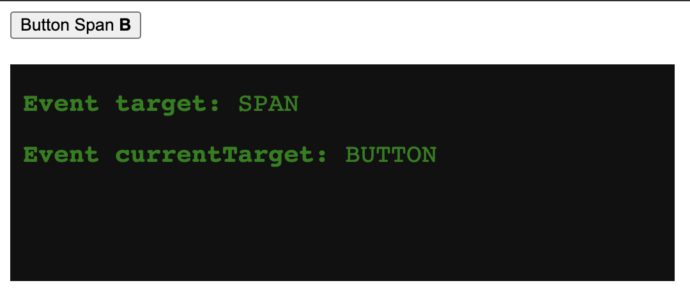

This is a common question that I ask myself sometimes, the easiest way I find to explain is as follows: 
`event.currentTarget` is the element where the event listener was **attached**, for example:
```
// HTML
<button id="my_element">Click me</button>

// JavaScript
document.getElementById("my_element").addEventListener("click", ...);
```
In this case, `my_element` is going to be the `event.currentTarget`.

On the other hand, `event.target` is any element (or any of its children) that triggered the event, for example:
```
// HTML
<p> This <b>is</b> a <span>paragraph</span>.</p>

// JavaScript
document.querySelector("p").addEventListener("click", ...);
```

In this case, clicking on any element will trigger the 
event listener, but `event.target` will be the specific element that was clicked, 
in this case, `p`, `b` or `span`.

The code below makes this explanation a bit more clear:

<iframe height="334.5621337890625" style="width: 100%;" scrolling="no" title="target vs currentTarget" src="https://codepen.io/jpedroribeiro/embed/zYLLdJV?default-tab=result" frameborder="no" loading="lazy" allowtransparency="true" allowfullscreen="true">
  See the Pen <a href="https://codepen.io/jpedroribeiro/pen/zYLLdJV">
  target vs currentTarget</a> by Pedro Ribeiro (<a href="https://codepen.io/jpedroribeiro">@jpedroribeiro</a>)
  on <a href="https://codepen.io">CodePen</a>.
</iframe>