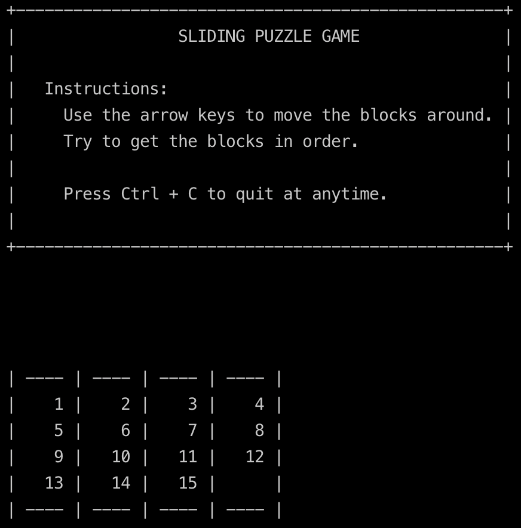

The other day I stumbled upon a [Sliding Puzzle Game](https://en.wikipedia.org/wiki/Sliding_puzzle) on [Wikipedia](https://en.wikipedia.org/wiki/Sliding_puzzle) and I thought it would be a fun weekend project to build it in JavaScript.

It runs on node so you can either clone the [repo](https://github.com/jpedroribeiro/SlidingPuzzleJS) and run it locally or you can use the Repl.it _iframe_ to run it in your browser (just press the green button):

<iframe height="600" style="width: 100%;" scrolling="no" title="target vs currentTarget" src="https://replit.com/@jpedroribeiro/SlidingPuzzleJS?embed=true" frameborder="no" loading="lazy" allowtransparency="true" allowfullscreen="true"></iframe>

The keyboard controls might be a bit odd at first, and I got into a **closure** hell with mixing functional with global variables, but it works and that's as much effort I'm going to put on this.

You can find the source code on GitHub [https://github.com/jpedroribeiro/SlidingPuzzleJS](https://github.com/jpedroribeiro/SlidingPuzzleJS)