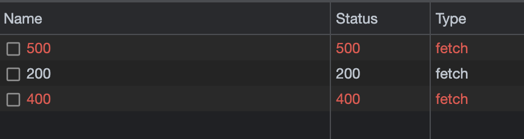

Have you ever wrapped your `fetch` on a `try/catch` block to catch 4xx and 5xx errors, and it didn't work?
    
```javascript
    try {
        const response = await fetch("https://httpstat.us/500");
        console.log(response);
    } catch (error) {
        console.log(error); // This will never be called!
    }
```

This happens to me more frequently than I would like to admit.

The reason why it doesn't work is that `fetch` will only throw error if there is a **network** error (or something like _CORS_).
A **4xx** or **5xx** is a server response and therefore not considered an error by `fetch`.

So what you need to do is to check the `response.ok` property, which will be `true` if the response is **200**:

```javascript
    let response;
    try {
      // Change the ending of the url below to 200 for a success response
      response = await fetch("https://httpstat.us/400");
        
      if(response.ok) {
        // Carry on...
        console.log("All good ✅");
      } else {
        throw (
          `Error: Response status ${response.status}`
        );
      }
      
    } catch(e) {
      // Handle error
      console.log(e); // Logs "Error: Response status 400"
    }
```

Below is a working example on CodePen: 

<iframe height="300" style="width: 100%;" scrolling="no" title="Error Handling in Fetch" src="https://codepen.io/jpedroribeiro/embed/PoygOZL?default-tab=js%2Cresult&theme-id=dark" frameborder="no" loading="lazy" allowtransparency="true" allowfullscreen="true">
  See the Pen <a href="https://codepen.io/jpedroribeiro/pen/PoygOZL">
  Error Handling in Fetch</a> by Pedro Ribeiro (<a href="https://codepen.io/jpedroribeiro">@jpedroribeiro</a>)
  on <a href="https://codepen.io">CodePen</a>.
</iframe>

And there you go. <br/>
Now you know how to handle errors in `fetch`! <br/>
Or, if you are like me, you'll be here next month looking for this post again.